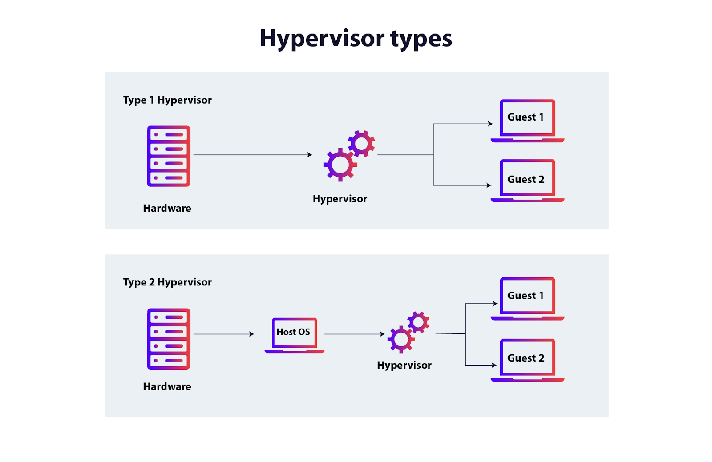

# Лабораторна робота №1
**Тема:** Знайомство з робочим середовищем віртуальних машин та особливостями операційної системи Linux

**Мета роботи:**
1. Знайомство з гіпервізорами різного типу, віртуалізацією при роботі з операційними системами;
2. Знайомство з основними видами сучасних ОС, короткий огляд їх можливостей.

**Матеріальне забезпечення занять:**
1. ЕОМ типу IBM PC;
2. ОС сімейства Windows та віртуальна машина Virtual Box (Oracle);
3. ОС GNU/Linux (будь-який дистрибутив);
4. Сайт мережевої академії Cisco netacad.com та його онлайн курси по Linux.

## Завдання для попередньої підготовки

1. \*Прочитайте короткі теоретичні відомості до лабораторної роботи та зробіть невеликий словник базових англійських термінів з питань класифікації віртуальних середовищ.

   > This part is made by Alina Mashovets

   | Definition      | Meaning                                  |
   | --------------- | -----------------------------------------|
   | virtual machine | a software emulation of a computer system|
   | shared hosting  | the type of hosting where your website shares server space with other websites|
   | dedicated hosting | an Internet hosting option in which a physical server (or servers) is dedicated to a single business customer |
   | machine simulator | allows users to build digital twins of any industrial system, providing a virtual replica that accurately mirrors real-world processes and behaviors |
   |type 1 hypervisor |virtualization software that has been installed directly onto the computing hardware |
   | type 2 hypervisor | an application installed on the host operating system |
   | host operating system | the primary operating system on your computer (e.g., Windows, macOS, or Linux) |
   | binary translation | a form of binary recompilation where sequences of instructions are translated from a source instruction set to the target instruction set |
   | guest operating system | the operating system installed on either a virtual machine or partitioned disk |
   | Java Virtual Machine(JVM) | a virtual machine that enables a computer to run Java programs as well as programs written in other languages that are also compiled to Java bytecode |
   | Linux | the kernel of the system, which is the central controller of everything that happens on the computer |
   | distributed operating system | system software over a collection of independent software, networked, communicating, and physically separate computational nodes |
   | graphical user interface (GUI) | a computer program that enables a person to communicate with a computer through the use of symbols, visual metaphors, and pointing devices |
   | command line interface (CLI) | a text-based interface where you can input commands that interact with a computer's operating system |
   | operating system | software that runs on a computing device and manages the hardware and software components that make up a functional computing system |

2. \*\*Прочитавши матеріал з коротких теоретичних відомостей дайте відповіді на наступні питання:

   > This part is made by Nazar Shurubor

   1. **Охарактеризуйте поняття «гіпервізор». Які бувають їх типи?**

      **Гіпервізор** - це програмне забезпечення для створення віртуальних машин, яке дозволяє запускати декілька операційних систем на одному фізичному хості. 
      Гіпервізор дозволяє декільком екземплярам операційних систем працювати поруч один з одним, використовуючи одні й ті ж самі обчислювальні ресурси. Цей процес називається віртуалізацією, а екземпляри операційної системи ― віртуальними машинами. 

      **Типи гіпервізорів:**
      | Тип      | Спосіб роботи         |
      | -------- | --------------------- |
      | 1-й тип  | Гіпервізор запущений одразу на самому залізі, замість ОС. |
      | 2-й тип  | Гіпервізор запущений всередині ОС. |

      

   2. Перерахуйте основні компоненти та можливості гіпервізорів відповідно до свого варіанту (порядковий номер по журналу), _табл.1_. 

      _Таблиця 1_
      | Варіант    | 1, 6, 11, 16, 21 | 2, 7, 12, 17, 22 | 3, 8, 13, 18, 23 | 4, 9, 14, 19, 24 | 5, 10, 15, 20, 25 |
      | ---------- | ---------------- | ---------------- | ---------------- | ---------------- | ----------------- |
      | Гіпервізор | VirtualBox       | VMware           | Xen              | **KVM**          | Hyper-V           |

      **KVM** _(kernel-based Virtual Machine)_ - is an open source virtualization technology for Linux operating systems. With KVM, Linux can function as a hypervisor that runs multiple, isolated virtual machines (VMs).

      **Main components of KVM:**
      - **Linux Kernel Module:** KVM is integrated into the Linux kernel and operates as part of it, allowing the use of processor-based hardware virtualization;
      - **QEMU:** Used as a device emulator for virtual machines and performance optimization;
      - **virtio:** A set of drivers for optimizing input/output operations between the host and guest OS;
      - **libvirt:** A library and set of utilities for managing KVM virtualization via command line or graphical interface;
      
      **Capabilities:**
      - **Full Virtualization:** KVM allows running any guest OS, including Linux, Windows, BSD, and others.
      - **High Performance:** Achieved through hardware acceleration and kernel integration.
      - **Live Migration:** The ability to transfer a running virtual machine to another host without stopping its operation.
      - **Flexible Resource Management:** Dynamic allocation of RAM, CPU time, disk space, and network interfaces.
      - **Security:** Uses [SELinux](https://www.redhat.com/en/topics/linux/what-is-selinux) or [AppArmor](https://ubuntu.com/server/docs/apparmor) for virtual machine isolation, supporting encryption and data protection.
      - **Hardware Acceleration Support:** KVM operates with Intel VT-x and AMD-V, significantly improving the performance of virtualized environments.

## Хід роботи

1. Подивіться ознайомчі відео та демонстраційні матеріали з наступних напрямків:
   - Linux - Кращі дистрибутиви 2023   
      _Доступ: https://youtu.be/PahmJBU9HKA_
   - ТОП 5 ПРИЧИН ЧОМУ АЙТІШНИКУ ВАРТО ПЕРЕЙТИ НА ЛІНУКС  
      _Доступ: https://youtu.be/bP3_mZKezvM_ 
   - Як встановити Linux разом з Windows спосіб №1 Microsoft Store  
      _Доступ: https://youtu.be/eEdGl6HvSdM_ 
   - Як встановити Linux разом з Windows спосіб №2 Dual Boot    
      _Доступ: https://youtu.be/Hfky8TEyXss_  
   - Як встановлювати програми на Linux. Linux українською №1  
      _Доступ: https://youtu.be/M8XHJME6cxI_ 
   - Як зробити панель завдань Linux як у Windows. Linux українською №2    
      _Доступ: https://youtu.be/9szAz-A4gaM_ 
   - Як встановити Ubuntu на VirtualBox   
      _Доступ: https://youtu.be/ADOaHm1VZII_
   - The Shell (Linux)   
      _Доступ: https://drive.google.com/open?id=0B0PV0_SM0LoDSVNPWUVRdUxaN2s_
   - Linux Desktop Environments: XFCE vs GNOME vs KDE   
      _Доступ: https://youtu.be/2JBGQfPR5xQ_

2. Дайте відповіді на наступні питання. 

   1. Перерахуйте етапи для розгортання операційної системи на базі віртуальної машини VirtualBox.
      > This part was written by Alina Mashovets

      1. Завантажити та встановити програму VirtualBox
      2. Натиснути «Створити» у вікні інструменту
      3. Ввести назву вітуальної машини
      4. Обрати тип і версію ОС, яка буде встановлюватися
      5. Вказати об'єм оперативної пам'яті, яка буде виділена для ВМ
      6. Створити новий віртуальний жорсткий диск або вибрати існуючий
      7. Обрати розмір віртуального жорсткого диску
      8. Обрати формат зберігання
      9. Натиснути "Створити"

   2. Чи є якісь апаратні обмеження при встановленні 32- та 64-бітних ОС?
      > This part was written by Nazar Shurubor

      - На 32-бітний процесор не можна встановити 64-бітну ОС. Проте, оскільки 64-бітні процесори є зворотньо сумісним, то на 64-бітний процесор можна поставити як і 64-бітну ОС, так і 32-бітну.
      - 32-бітні ОС не підтримують більше ніж **4 ГБ** ОЗП. Якщо в компʼтері стоїть більше ніж 4 ГБ оперативної памʼяті, то обовʼязково треба ставити 64-бітну ОС.
   3. Які основні етапи при встановленні OS Linux в текстовому режимі?
      > This part was written by Nazar Shurubor

      Розберемо на прикладі встановлення **Arch Linux**. _Arch_ сам по собі є мінімальним дистрибутивом, і встановщик не має [середовища стільниці](https://wiki.archlinux.org/title/Desktop_environment_(Українська)).

      1. Запустити live environment з установочного диску;
      2. Виставити правильну розкладку клавіатури та шрифт;
      3. Підключити систему до інтернету;
      4. Оновити час системи за допомогою команди `timedatectl`;
      5. Розбити диск на потрібні для встановлення розділи (наприклад, розділ EFI, розділ swap памʼяті та розділ, для кореневої папки);
      6. Відформатувати створені розділи;
      7. Згенерувати [fstab](https://wiki.archlinux.org/title/Fstab) файл;
      8. За допомогою команди `chroot` переключити контекст у нову систему;
      9. Налаштувати часовий пояс;
      10. Налаштувати мову та формати;
      11. Встановити пароль для користувача `root`;
      12. Створити користувач(а/ів) системи;
      13. Встановити [bootloader](https://wiki.archlinux.org/title/Boot_loader);
      14. Перезапуститися вже в установлену систему.

      > Для **Arch Linux** є також скрипт-інсталятор [archinstall](https://wiki.archlinux.org/title/Archinstall), для спрощеного і автоматизованого встановлення ОС.
   4. \*Яким чином можна до установити графічні оболонки Gnome та KDE в Linux, якщо вона вже встановлена в текстовому режимі (вкажіть необхідні команди та пакети)? 
      > This part was written by Nazar Shurubor

      **Установлення GNOME:**
      1. Встановити **GNOME**: `sudo pacman -S gnome`. Менеджер також запитає які компоненти слід встановити. Можна просто натиснути ENTER, щоб встановити всі.
      2. Встановити [Display Manager](https://wiki.archlinux.org/title/Display_manager), наприклад **GDM**: `sudo pacman -S gdm`
      3. Включити **GDM**: `sudo systemctl enable --now gdm.service`

      **Установлення KDE Plasma (на Wayland):**
      1. Встановити Xorg, KDE Plasma [Desktop Environment](https://wiki.archlinux.org/title/Desktop_environment_(Українська)), сесію Wayland і _(необовʼязково)_ набір програм KDE: `sudo pacman -S xorg plasma plasma-wayland-session kde-applications`;
      2. Перезапустити компʼютер: `shutdown now`

   5. \*\*Дайте коротку характеристику графічних інтерфейсів, що використовуються в різних дистрибутивах Linux відповідно до свого варіанту (порядковий номер по журналу), _табл.2_.

_Таблиця 2_
| Варіант           | 1, 4, 7, 10, 13, 16, 19, 22, 25 | 2, 5, 8, 11, 14, 17, 20, 23 | 3, 6, 9, 12, 15, 18, 21, 24 |
| ----------------- | ------------------------------- | --------------------------- | --------------------------- |
| Графічна оболонка | KDE та Fluxbox                  | GNOME та JWM                | **Xfce та Fvwm**                |

**XFCE** is a free and open-source desktop environment for Linux and other Unix-like operating systems.
The **F Virtual Window Manager (FVWM)** is a virtual window manager for the X Window System. 

## Контрольні запитання

1. Порівняйте гіпервізори типу 1 та типу 2, яка між ними відмінність та сфера їх застосування?
2. Розкрийте поняття «GNU GPL», яка його основна концепція? 
3. В чому суть програмного забезпечення з відкритим кодом?
4. \*Що таке дистрибутив?
5. \*Які задачі системного адміністрування можна реалізувати на базі ОС Linux?
6. \*Як пов'язані між собою ОС Android та Linux? 
7. \*\*Основні можливості та сфера використання Embedded Linux?
8. \*\*Яким чином можна змінити типу завантаження Linux: в текстовому режимі (3 рівень) або графічному (рівень 5)? Чим відрізняються режими CLI та GUI?

## Висновки
