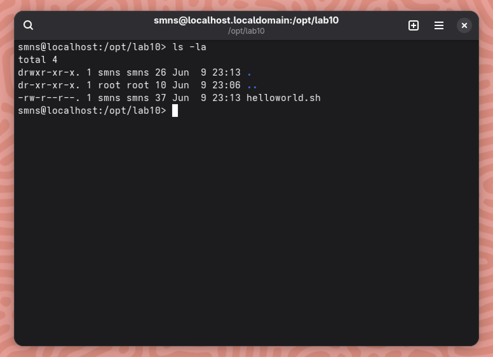

# Лабораторна робота №10

**Тема:** Захист системи та користувачів у Linux. Створення користувачів та груп

**Мета роботи:**

1. Отримання практичних навиків роботи з командною оболонкою Bash.
2. Знайомство з базовими діями при створенні нових користувачів та нових груп користувачів.

**Матеріальне забезпечення занять:**

1. ЕОМ типу IBM PC;
2. ОС сімейства Windows та віртуальна машина Virtual Box (Oracle);
3. ОС GNU/Linux (будь-який дистрибутив);
4. Сайт мережевої академії Cisco netacad.com та його онлайн курси по Linux.

**Виконували:**

- Машовець Аліна
- Шурубор Назар

## Завдання для попередньої підготовки

1. \*Прочитайте короткі теоретичні відомості до лабораторної роботи та зробіть невеличкий словник базових англійських термінів з питань призначення команд та їх параметрів.

    | Term       | Definition                                                                                                   |
    | ---------- | ------------------------------------------------------------------------------------------------------------ |
    | `/tmp`     | Directory where all users are allowed to create temporary files.                                             |
    | `/var/tmp` | Directory where all users are allowed to create temporary files.                                             |
    | `chmod`    | Command used to change the permissions of files and directories.                                             |
    | `chown`    | Command used to change the user ownership of files and directories.                                          |
    | `ln -s`    | Command used to create a symbolic link.                                                                      |
    | `ls -d`    | The `-d` option of the ls command is used to refer to the current directory, and not the contents within it. |
    | sticky bit | Permission is used to prevent other users from deleting files that they do not own in a shared directory.    |

2. Вивчіть матеріали онлайн-курсу "NDG Linux Essentials":
    - Chapter 17 - Ownership and Permissions;
    - Chapter 18 - Special Directories and Files.
3. Пройдіть тестування у курсі NDG Linux Essentials за такими темами:
    - Chapter 17 Exam;
    - Chapter 18 Exam.
4. На базі розглянутого матеріалу дайте відповіді на наступні питання:
    - Яке призначення команди `id`?

        The `id` command displays the user and group names of a currently logged in or provideed user.

    - Як переглянути які права доступу має власник файлу?

        Using the `-l` argument for the `ls` command we can get permissions of files.

    - \*Як змінити власника групи?

        There is not really a way to set the owner of a group in Linux.

    - \*Як можна переглянути у терміналі який тип поточного файлу? Наведіть приклади для різних типів файлів.

        Using the `file` command:

        ```sh
        $ file labs/1.md
        labs/1.md: Unicode text, UTF-8 text, with very long lines (752)
        $ file labs/assets/figure-6.1.png 
        labs/assets/figure-6.1.png: PNG image data, 1043 x 247, 8-bit/color RGB, non-interlaced
        ```

    - \*\*Для чого використовуються дозволи `Setuid` та `Setgid`?

        The `setuid` and `setgid` commands are used to make a file always execute as its owner, no matter who is actually running the file.

    - \*\*Для чого в системі потрібен так званий "липкий біт" (Sticky Bit). Наведіть приклади коли цей дозвіл доцільно використовувати.

        The sticky bit is used to mark a directory as a deletable only by the owner, even if other users have access to the directory.
        For example the `/tmp` directory has this bit set.

        ```sh
        $ ls -ld /tmp
        drwxrwxrwt 10 root root ... /tmp
        ```

5. Підготувати в електронному вигляді початковий варіант звіту:
    - Титульний аркуш, тема та мета роботи;
    - Словник термінів;
    - Відповіді на п.4.1-4.6 з завдань для попередньої підготовки.

## Хід роботи

1. Початкова робота в CLI-режимі в Linux ОС сімейства Linux:
    - Запустіть операційну систему Linux Ubuntu. Виконайте вхід в систему та запустіть термінал (якщо виконуєте ЛР у 401 ауд.);
    - Запустіть віртуальну машину Ubuntu_PC (якщо виконуєте завдання ЛР через академію netacad);
    - Запустіть свою операційну систему сімейства Linux (якщо працюєте на власному ПК та її встановили) та запустіть термінал.

2. Опрацюйте всі приклади команд, що представлені у лабораторних роботах курсу NDG Linux Essentials: Lab 17: Ownership and Permissions та Lab 18: Special Directories and Files. Створіть таблицю команд вивчених у п.2 ходу роботи у наступному вигляді:

    | Назва команди | Її призначення та функціональність                                 |
    | ------------- | ------------------------------------------------------------------ |
    | `id`          | Displays the user ID (UID), group ID (GID), and group memberships. |
    | `newgrp`      | Switches the current group ID to another group.                    |
    | `exit`        | Exits the current shell session or script.                         |
    | `chgrp`       | Changes the group ownership of a file or directory.                |
    | `chown`       | Changes the owner and/or group of a file or directory.             |
    | `chmod`       | Modifies file or directory permissions.                            |
    | `stat`        | Displays detailed information about a file or directory.           |
    | `umask`       | Sets default permission bits for newly created files.              |

    > **Примітка:** Скріншоти виконання команд в терміналі можна не представляти, достатньо коротко описати команди в таблиці.

3. Виконайте наступні практичні завдання у терміналі наступні дії (продемонструвати скріншоти):
    - створіть трьох нових користувачів;

        We will create three users using the `useradd` command and set their password with `passwd` like this:

        ```sh
        sudo useradd -m stud1
        sudo passwd stud1

        sudo useradd -m stud2
        sudo passwd stud2

        sudo useradd -m stud3
        sudo passwd stud3
        ```

    - створіть нову групу користувачів, туди додайте двох, з трьох створених користувачів;

        Let's create a new with `groupadd`:

        ```sh
        sudo groupadd grp1
        ```

        And add two of the users we've created to it:

        ```sh
        sudo usermod -aG grp1 stud1
        sudo usermod -aG grp1 stud2
        ```

    - створіть новий файл, який буде доступний на зчитування, редагування та виконання власником файлу, наприклад найпростіший скриптовий сценарій;

        Let's place the file in `/opt/lab10` and make a simple hello world bash-script inside it:

        ```sh
        sudo mkdir /opt/lab10
        cd /opt/lab10
        sudo chown smns:smns ./
        vim helloworld.sh
        ```

        Here's what the folder looks like right now:

        

        Now let's make it readable, writable and executable for the owner:

        ```sh
        chmod 700 helloworld.sh
        ```

        Now we can see the updated perms and the execution output:

        

    - для користувачів групи власника надайте дозволи на перегляд та виконання (без дозволу на редагування) цього файлу;

        To make the file executable and readable for people in the group we need to update the second part of the permission mask
        to `5`, which is `1` (execute) plus `4` (read).

        ```sh
        chmod 750 helloworld.sh
        ```

        Now file's rights are the following:

        ```sh
        $ ls -l
        total 4
        -rwxr-x---. 1 smns smns 37 Jun  9 23:13 helloworld.sh
        ```

    - для інших користувачів заборонити доступ до цього файлу;

        To do that we'd need to set the third part of the permission mask to `0`, but as we've set it is already that, we will skip this task.

    - \*подібні дії виконайте для директорій - створіть директорію, яка буде доступна для всіх трьох користувачів, створіть директорію, яка буде доступна тільки для власника, створіть директорію, яку користувачі групи власника зможуть переглядати, але не редагувати;

        Let's make the directories:

        ```sh
        mkdir dir1
        mkdir dir2
        mkdir dir3
        ```

        The first directory will be accessible to anyone:

        ```sh
        chmod 777 dir1/
        ```

        The second directory will be accessible only to the owner:

        ```sh
        chmod 700 dir2/
        ```

        And the third directory will be accessible to the owner and the group, but not for writing:

        ```sh
        chmod 750 dir3/
        ```

        Here's what the rights look now:

        ```sh
        $ qls -l
        total 4
        drwxrwxrwx. 1 smns smns  0 Jun 10 15:12 dir1
        drwx------. 1 smns smns  0 Jun 10 15:12 dir2
        drwxr-x---. 1 smns smns  0 Jun 10 15:12 dir3
        -rwxr-x---. 1 smns smns 37 Jun  9 23:13 helloworld.sh
        ```

    - \*створіть порожній файл під назвою `emptyfile` за допомогою команди `touch emptyfile`. Тепер "обнуліть" дозволи для файлу з `chmod 000 emptyfile`. Що станеться, якщо змінити дозволи для `emptyfile`, передавши лише одне значення для `chmod` у числовому режимі, наприклад, `chmod 4 emptyfile`? Що буде, якщо ми використаємо два числа, наприклад `chmod 44 emptyfile`? Що ми можемо дізнатися про те, як `chmod` зчитує числове значення?

        Passing only one value to the `chmod` command, like, for example `chmod 4 emptyfile`, will only set the "all users" value.
        So the resulting rights will be `-------r--.`. Passing two numbers will set the "group" and "all users" values accordingly.
        So if `chmod 44 emptyfile` is ran the resulting rights will be `----r--r--.`.

    - \*\*створіть каталог під назвою, де всі файли автоматично будуть належати Вашій групі користувачів і можуть бути видалені лише користувачем, який їх створив?

        Let's make the directory:

        ```sh
        mkdir shared_dir
        ```

        Set it's permissions:

        ```sh
        sudo chmod 770 shared_dir
        ```

        Let's set it's group to the one we've created:

        ```sh
        sudo chown :grp1 shared_dir
        ```

        Now to make the files created inside the directory automatically owned by the group we need to setgid for the directory:

        ```sh
        sudo chmod g+s shared_dir
        ```

        And now here's how the permissions for the directory look like:

        ```sh
        $ ls -ld shared_dir
        drwxrws---. 1 smns grp1 0 Jun 10 16:53 shared_dir/
        ```

        Now to make it so people cannot delete others files inside `shared_dir` we need to set the "sticky bit":

        ```sh
        sudo chmod o+t shared_dir
        ```

        Now here's the final form of the permissions for this directory:

        ```sh
        $ ls -ld shared_dir/
        drwxrws--T. 1 smns grp1 0 Jun 10 16:53 shared_dir/
        ```

    - \*\*під кожним користувачем створіть по одному новому файлу, та жорстке та символічне посилання на нього;

        Let's create a session for `stud1`:

        ```sh
        su stud1
        ```

        Now let's create a file in the `/opt/lab10/shared_dir` directory:

        ```sh
        cd /opt/lab10/shared_dir
        echo "Hello from stud1!" > stud1_file
        ```

        And create a hardlink and a symlink:

        ```sh
        ln stud1_file stud1_hardlink
        ln -s stud1_file stud1_symlink
        ```

        And repeat that for users `stud2` and `stud3`...

        However when we get to `stud3` we will get the following:

        

        This is because the directory is owned by the group `grp1`, but when we were adding users to groups we only added
        `stud1` and `stud2` to the group, but not `stud3`.

        Here's what are the resulting contents of the folder:

        

    - \*\*спробуйте іншими користувачами переглянути ці файли;

        Let's try reading `stud1_file` as `stud2` and `stud3`.

        `stud2` is indeed able to read `stud1_file` owned by `stud1`, however `stud3` is again getting "Permission denied".

    - \*\*спробуйте іншими користувачами видалити ці файли, зробіть висновки.

        We're going to try delete file `stud1_file` as `stud2` and as `stud3`.

        `stud2`'s output was the following and we couldn't delete the file:

        ```sh
        $ rm stud1_file
        rm: remove write-protected regular file 'stud1_file'? y
        rm: cannot remove 'stud1_file': Operation not permitted
        ```

        And `stud3` is again getting "Permission denied" right away.

## Відповіді на контрольні запитання

1. Наведіть приклади зміни прав доступу символічним методом (Symbolic Method)?
2. Наведіть приклади зміни прав доступу числовим методом (numeric method, octal method)?
3. Яке призначення команди `umask`?
4. Порівняйте жорсткі та символічні посилання?
5. \*Чи можна виконати файл, для якого є права на виконання, але не встановлені права на читання (`--x`)? Поясніть.
6. \*Якщо ми змінюємо права доступу та дозволи в поточній сесії чи будуть вони збережені в наступній?.
7. \*Чи є якийсь шаблон, яким система користується щодо прав та доступів при створенні нових файлів. Як можна змінити права дозволу за замовчуванням?
8. \*Яким чином можна створити жорстке посилання? В яких ситуаціях їх доцільно використовувати?
9. \*Яким чином можна створити символічне посилання? В яких ситуаціях їх доцільно використовувати?
10. \*\*Уявіть, що програмі потрібно створити одноразовий тимчасовий файл, який більше ніколи не знадобиться після закриття програми. Який правильний каталог для створення цього файлу?
11. \*\*Є файл оригінал та для нього створено два посилання - символічне та жорстке. Що відбудеться з іншими файлами, якщо видалити:
    - файл оригінал;
    - символічне посилання;
    - жорстке посилання.

## Висновки
