# Лабораторна робота №2

**Тема:** Знайомство з інтерфейсом та можливостями ОС Linux.

**Мета роботи:**

1. Знайомство з інтерфейсами ОС Linux.
2. Отримання практичних навиків роботи в середовищах ОС Linux та мобільної ОС – їх графічною оболонкою, входом і виходом з системи, ознайомлення зі структурою робочого столу, вивчення основних дій та налаштувань при роботі в системі

**Матеріальне забезпечення занять:**

1. ЕОМ типу IBM PC;
2. ОС сімейства Windows та віртуальна машина Virtual Box (Oracle);
3. ОС GNU/Linux (будь-який дистрибутив);
4. Сайт мережевої академії Cisco netacad.com та його онлайн курси по Linux.

**Виконували:**

- Машовець Аліна
- Шурубор Назар

## Завдання для попередньої підготовки

1. \*Прочитайте короткі теоретичні відомості до лабораторної роботи та зробіть невеликий словник базових англійських термінів з питань призначення команд та їх параметрів.

2. Вивчіть матеріали онлайн-курсу академії Cisco “NDG Linux Essentials”:
    - Chapter 3 - Working in Linux
    - Chapter 4 - Open Source Software and Licensing

3. Пройдіть тестування у курсі **NDG Linux Essentials** за такими темами:
    - Chapter 03 Exam
    - Chapter 04 Exam

4. \*\*Дайте визначення наступним поняттям:
    - CLI-режим
    - Термінал на основі графічного інтерфейсу користувача
    - Віртуальний термінал

        - The command line interface (CLI) is a simple text input system for entering anything from single-word commands to complicated scripts. Most operating systems have a CLI that provides a direct way of accessing and controlling the computer.
        - A GUI terminal is a program within the GUI environment that emulates a terminal window. GUI terminals can be accessed through the menu system.
        - A virtual terminal can be run at the same time as a GUI but requires the user to log in via the virtual terminal before they can execute commands.

5. Підготувати в електронному вигляді початковий варіант звіту:
    - Титульний аркуш, тема та мета роботи
    - Словник термінів
    - Відповіді на п.4 з завдань для попередньої підготовки

## Хід роботи

1. Робота в графічному режимі в ОС сімейства Linux (робота з інтернет-джерелами):

    1. Оберіть графічну оболонку для ОС сімейства Linux, яку ви хочете розглянути. Розгляньте структуру робочого простору користувача, та опишіть основні його компоненти:

        - Основне меню
        - Панелі швидкого доступу
        - Пошук
        - Доступ до нових робочих столів тощо

        > **Примітка:** Якщо ви обрали інший графічний інтерфейс то компоненти меню можуть бути іншими.  

        As an example I will use the KDE Plasma desktop environment (DE).
        Here's the desktop on my home machine that has KDE:

        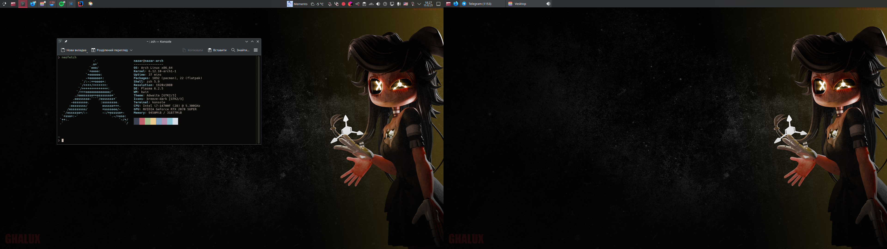

        There is a "start menu" equivalent called "The Application Launcher".
        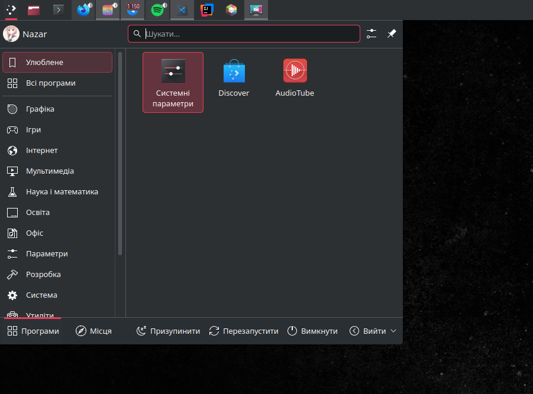
        I can open any installed app from it, search for apps, files, etc.

        Also there is a Quick launch tool, that I can bring up with _Alt+Space_:
        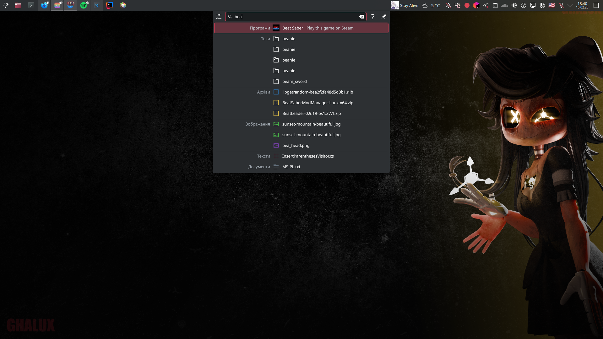

        There is a view of all desktops if you put your mouse into the top-left corner of the screen.
        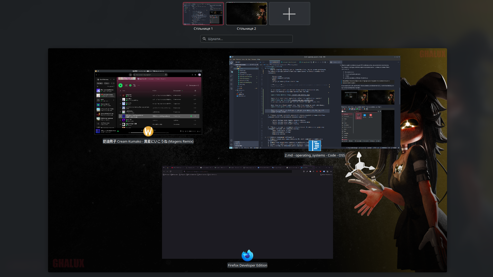

    2. \*Запуск програм. Дослідіть можливості запуску додатків різними способами _(описати спосіб і за можливості показати скріншоти)_:

        - Запуск програм через панель швидкого запуску
        - Запуск програм через пошук в меню / глобальне меню
        - Запуск програм через віджет запуску

        As mentioned before you can launch apps from a couple places. First being the application launcher:
        

        Second, you can launch pinned apps from apps widget on the panel:
        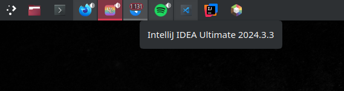

        Third, there are search bars in a couple of places like the desktop manager, the app launcher and you can bring in up with _Alt+Space_:
        

    3. \*Вихід з системи та завершення роботи в Linux. Як виконати в графічному інтерфейсі наступні дії (наведіть скріни):

        - Зміна користувача на root
        - Перезавантаження системи
        - Вимкнення системи

        To shutdown or reboot the system in KDE you can just click the needed button in the app launcher menu:
        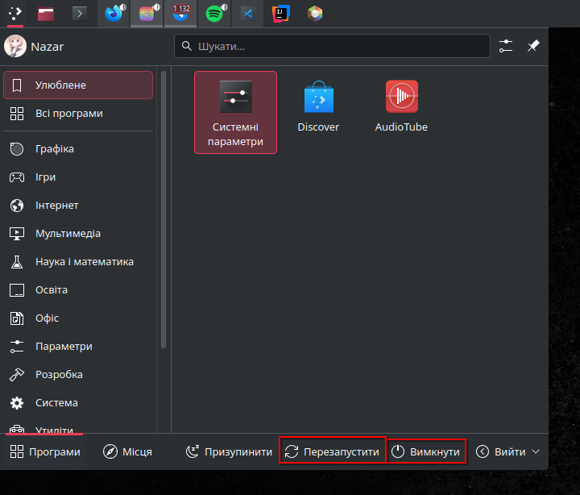

        Logging in as root into a GUI environment is not recommended and needs extra steps to unlock the root account. As it is dangerous, I will avoid doing it. If access to the root user is really needed you always can log in as root in the terminal:

        ```sh
        > whoami
        nazar
        > sudo su
        [sudo] пароль до nazar: 
        [root@nazar-arch nazar]# whoami
        root
        ```

2. \*\*Робота в середовищі мобільної ОС.

    As an iOS user, I will be reviewing this mobile operating system.
    1. Опишіть головне меню вашої мобільної ОС, який графічний інтерфейс вона використовує?

        iOS doesn't have a traditional "main menu" like Windows or Android. Instead, the Home Screen acts as a central navigation hub where the user interacts with applications, widgets, and system functions.
        iOS uses a graphical user interface based on UIKit. Also in 2019, Apple introduced a new framework for building interfaces - SwiftUI.
        The user interface is built around the device's multi-touch screen, including a virtual keyboard. The iPhone has Wi-Fi and can connect to many different cellular networks, including 3G, LTE, 5G. An iPhone can shoot video, take photos, play music, send and receive email, browse the web, send texts, GPS navigation, record notes, do mathematical calculations, and receive visual voicemail.
        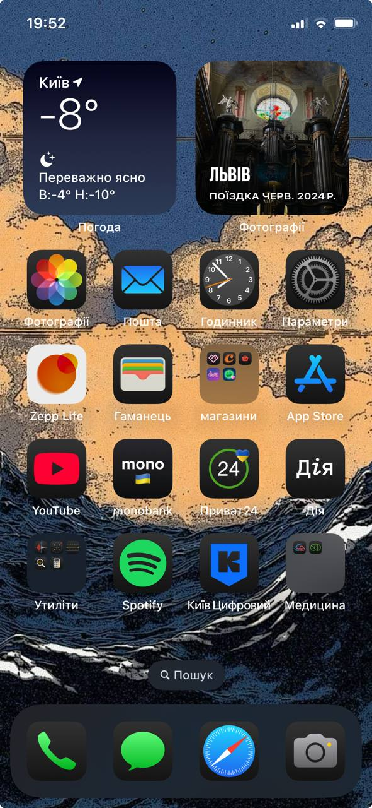

    2. Опишіть меню налаштувань компонентів мобільного телефону.
        The iOS settings menu is located in the "Settings" application, which contains sections for managing all the components of the device.
        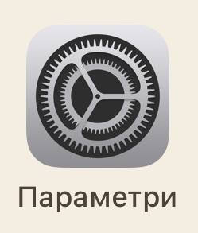

        Main sections:
        - Wi-Fi, Bluetooth, Cellular Data, Personal Hotspot - for Internet connection and communication;
        - Battery - for tracking battery status;
        - General - for managing overall setup and preferences for iPhone, such as software updates, device language, AirDrop etc.;
        - Camera - for camera and video settings;
        - Display & Brightness - for adjusting the screen: changing the brightness, dark mode, True Tone, Night Shift, adjusting the text size.
        - Siri - an intelligent assistant that can help find information and get things done;
        - Notifications - notification settings for individual applications;
        - Sounds & Haptics - volume control, ringtones, haptic settings.

        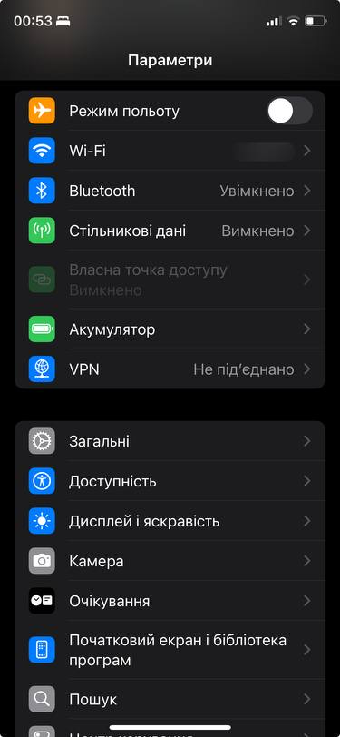
        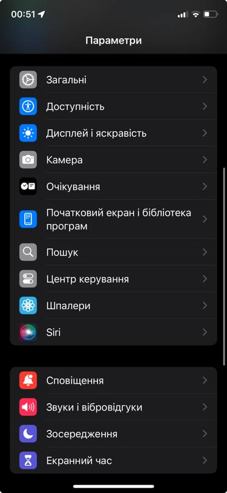

    4. Вхід у систему та завершення роботи пристрою. Особливості налаштувань живлення батареї.
        On the iPhone, there is no traditional "login" like on computers. After turning on the device, you need to unlock the screen using Face ID, Touch ID, or a password.
        Shutting down the iPhone is possible in two ways: 1. Buttons: Press and hold the power button + volume button → slide to power off. 2. Via "Settings": General → Shut Down.

        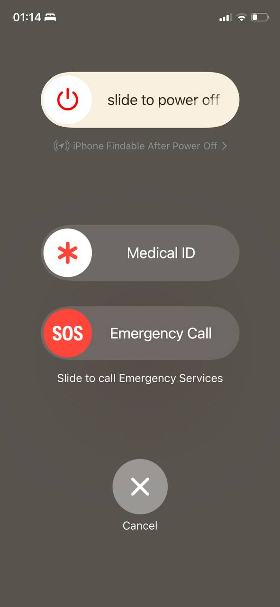
        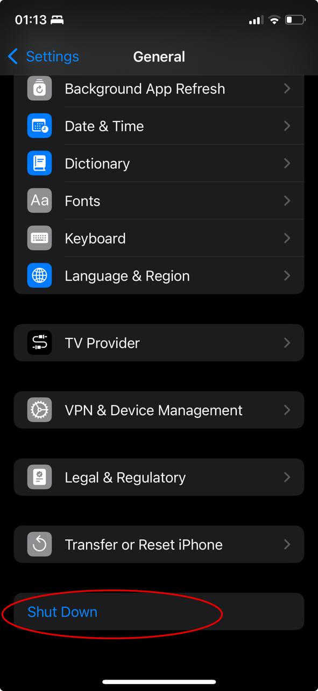

## Контрольні запитання

1. Наведіть приклади серверних додатків Linux для сервера баз даних, серверів розсилки повідомлень та файлообмінників.

    Database servers: MySQL, PostgreSQL, MongoDB;
    Mail servers: Postfix, Exim, RabbitMQ;
    File servers: Samba, NFS(Network File System), FTP servers (vsftpd, proftpd).

2. Порівняйте оболонки Bourne, C, Bourne Again (Bash), the tcsh, Korn shell (Ksh) та zsh.

3. Для чого потрібен менеджер пакетів. Які менеджери пакетів ви знаєте у Linux?

    A package manager is a special program in Linux that automates the process of installing, updating, uninstalling, and managing programs and dependencies.
    Known package managers:

    - Debian-based: APT, dpkg
    - Red Hat-based6: YUM, DNF, RPM
    - Arch: Pacman
    - Gentoo: Portage
    - Universal package managers: Flatpak, Snap, AppImage

4. \*Які засоби безпеки використовуються в Linux?

    - Access Control & User Permissions:
        - DAC (Discretionary Access Control);
        - RBAC (Role-Based Access Control);
        - ACL (Access Control Lists);
        - Sudo - a command that runs an elevated prompt without a need to change your identity.
    - Network Security:
        - iptables/nftables & Firewalld;
        - Fail2Ban;
        - SSH Security.
    - Authentication & Login Security:
        - Authentication & Login Security;
        - 2FA (Two-Factor Authentication).
    - Virtualization & Container Security:
        - Docker Security;
        - SELinux/AppArmor for Containers;
        - KVM/QEMU.

5. \*Чому використання віртуалізації зараз стало таким актуальним?

6. \*Як ви розумієте поняття контейнеризації?

    **Containerization** is a lightweight virtualization technology that isolates applications in containers using the host OS kernel, enabling portability, scalability, and efficient resource management.

7. \*Які переваги/недоліки використання програмного забезпечення з відкритим кодом?

8. \*\*Скільки активних віртуальних консолей (терміналів) може бути у процесі роботи Linux по замовчуванню. Як їх викликати та між ними перемикатися? Наведіть приклади?

9. \*\*Яка віртуальна консоль (термінал) виконує функцію графічної оболонки?

    The graphical shell typically runs on tty7 (or tty1 in some systems).

10. \*\*Чи можлива реєстрація в системі Linux декілька разів під одним і тим же системним ім’ям? Які переваги це може надати?

## Висновки

При виконанні лабораторної ми ознайомилися з інтерфейсом ОС Linux та її можливостями. Ми ознайомилися з графічними оболонками ОС Linux та мобільної ОС, з входом і виходом із системи, ознайомлення зі структурою робочого столу, вивчення основних дій та налаштувань при роботі в системі.
