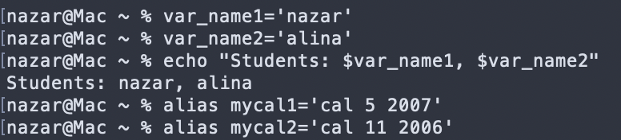
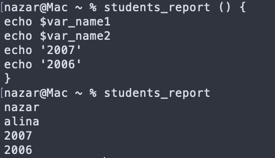
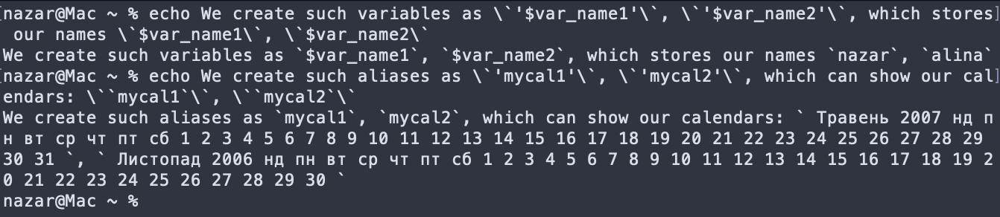
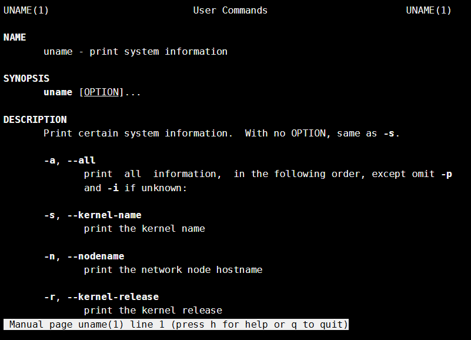
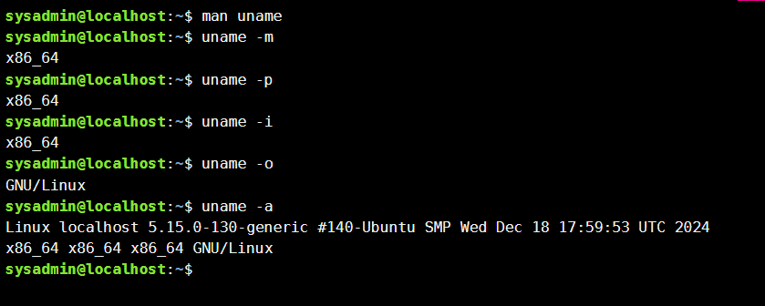
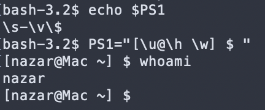

# Лабораторна робота №3

**Тема:** Знайомство з базовими командами CLI-режиму в Linux

**Мета роботи:**

1. Знайомство з базовими командами CLI-режиму в Linux.
2. Знайомство з базовими текстовими командами в термінальному режимі роботи в різних ОС.

**Матеріальне забезпечення занять:**

1. ЕОМ типу IBM PC;
2. ОС сімейства Windows та віртуальна машина Virtual Box (Oracle);
3. ОС GNU/Linux (будь-який дистрибутив);
4. Сайт мережевої академії Cisco netacad.com та його онлайн курси по Linux.

**Виконували:**

- Машовець Аліна
- Шурубор Назар

## Завдання для попередньої підготовки

1. \*Прочитайте короткі теоретичні відомості до лабораторної роботи та зробіть невеликий словник базових англійських термінів з питань призначення команд та їх параметрів.

    | Word           | Meaning            |
    | -------------- | ------------------ |
    | Bash           | The most commonly used shell for Linux distributions |
    | PATH environment variable | Variable containing a list that defines which directories the shell looks in for commands |
    | echo           | Command that displays output in the terminal |
    | export         | Command that turns a local variable into an environment variable |
    | history        | Command that outputs a list of previously executed commands |
    | type           | Command that determines information about command type |

2. Вивчіть матеріали онлайн-курсу академії Cisco “NDG Linux Essentials”:
    - Chapter 5 - Command Line Skills
    - Chapter 6 - Getting Help

3. Пройдіть тестування у курсі NDG Linux Essentials за такими темами:
    - Chapter 05 Exam
    - Chapter 06 Exam

4. \*Дайте визначення наступним поняттям:
    - **Command-line interpreter** (Командний інтерпретатор) a system software that understands and executes commands that are entered interactively by a human or from an another program.
    - **Shell** (Оболонка) is the command-line interpreter that translates commands entered by a user into actions to be performed by the operating system.
    - **Command** (Команда) is a software program that, when executed on the CLI, performs an action on the computer.

5. \*\*Дайте відповіді на наступні питання:
    - Яку базову інформацію надає рядок запрошення prompt?

        Typically the prompt contains information about the user and the system. Below is a common prompt structure:

        ```bash
        sysadmin@localhost:~$
        ```

        The prompt shown contains the following information:
        - Username (sysadmin)
        - System name (localhost)
        - Current Directory (~)

    - Для чого команді потрібні параметри та аргументи?

        An argument can be used to specify something for the command to act upon. Options can be used with commands to expand or modify the way a command behaves.

    - Яке призначення команд `ls`, які параметри та аргументи вона може мати? Наведіть 3 приклади.

        The `ls` command outputs the contents of a directory.
        If the directory is not provided as an argument it will use the current working directory.

        Some options for `ls` are:

        - `-l`: List files in the long format.

            ```bash
            $ ls -l                                                     
            total 4                                                                         
            drwxr-xr-x 2 sysadmin sysadmin    6 Feb  8  2021 Desktop                        
            drwxr-xr-x 4 sysadmin sysadmin 4096 Feb  8  2021 Documents                      
            drwxr-xr-x 2 sysadmin sysadmin    6 Feb  8  2021 Downloads                      
            drwxr-xr-x 2 sysadmin sysadmin    6 Feb  8  2021 Music                          
            drwxr-xr-x 2 sysadmin sysadmin    6 Feb  8  2021 Pictures                       
            drwxr-xr-x 2 sysadmin sysadmin    6 Feb  8  2021 Public                         
            drwxr-xr-x 2 sysadmin sysadmin    6 Feb  8  2021 Templates                      
            drwxr-xr-x 2 sysadmin sysadmin    6 Feb  8  2021 Videos
            ```

        - `-a`: Include directory entries whose names begin with a dot (`.`).

            ```bash
            $ ls -a                                                     
            .             .bashrc   .selected_editor           Documents  Pictures   Videos 
            ..            .cache    .sudo_as_admin_successful  Downloads  Public            
            .bash_logout  .profile  Desktop                    Music      Templates         
            ```

        - `-r`: Reverse the order of the sort.

            ```bash
            $ ls -r                                                     
            Videos  Templates  Public  Pictures  Music  Downloads  Documents  Desktop
            ```

    - Яким чином можна використати історію команд, які переваги це надає?

        The `history` command outputs the list of recently used commands.

        ```bash
        $ history                                                   
        1  ls -l                                                                    
        2  ls -a                                                                    
        3  ls -r                                                                    
        4  history
        ```

        We can run the latest used command with `!!` (which is `history`). Or we can run the latest used `ls` command with `!ls` (which is `ls -r`).
        Also we can run commands by index. For example, `!2` will run `ls -a` and `!-4` will run `ls -l`.

    - Яке призначення команди echo?

        `echo` сommand displays output in the terminal.

    - Охарактеризуйте поняття змінної в оболонці Bash, які типи змінних вона підтримує?

        Variables are used to store values (as in every other place). For example, I can declare a variable `var_name1` and `var_name2`, which hold our names in their values:

        ```bash
        $ var_name1='nazar'
        $ var_name2='alina'
        $ echo "$var_name1, $var_name2"
        nazar, alina
        ```

        There are three types of variables:
        - **Local Variables:** Temporary variables, that exist only in the current shell. The `var_name1` and `var_name2` variables in the previous example are local variables.
        - **Environment Variables:** Global variables, that exist in all shells, but do not persist between boots (as they are created on boot).

    - Яке призначення команд env, export та unset?

        The `env` command is used to output the list of environment (global) variables.

        The `export` command is used to set the environment variables:

        ```bash
        $ export var_name1='nazar'
        $ env | grep var_name1
        var_name1=nazar
        ```

        The `unset` command is used to remove (delete) the environment variable:

        ```bash
        $ export var_name1='nazar'
        $ env | grep var_name1
        var_name1=nazar
        $ unset var_name1
        $ env | grep var_name1
        ```

    - Які команди для отримання довідки по командам в терміналі ви знаєте?

        The Manual (man) Pages, which can be used like:

        ```bash
        man ls
        ```

        And also the info documentation (which is more for learning the information, rather than being a reference guide):

        ```bash
        info ls
        ```

6. Підготувати в електронному вигляді початковий варіант звіту:

    - Титульний аркуш, тема та мета роботи
    - Словник термінів
    - Відповіді на п.4 та п.5 з завдань для попередньої підготовки

## Хід роботи

1. Опрацюйте всі приклади команд, що представлені у лабораторній роботі курсу **NDG Linux Essentials - Lab 5: Command Line Skills** та **Lab 6: Getting Help**. Створіть таблицю для опису цих команд:

    | Назва команди | Її призначення та функціональність |
    | ------------- | ---------------------------------- |
    | ls            | Виводить інформації про каталоги та файли. За замовчуванням без аргументів відображає інформацію для поточного каталогу |
    | ls -l         | Використанні параметру -l в команді ls дозволяє відобразити інформацію про файли, розташовані в поточному робочому каталозі, у довгому форматі, який надає більш розширену додаткову інформацію |
    | ls -l /tmp    | Використання аргументу /tmp в поєднанні з параметром -l в команді ls дозволяє відобразити детальну інформацію про файли в каталозі /tmp |
    | type _command_  | can be used to determine information about command type |
    | cd _path_       | allows users to change their current working directory within the file system |
    | which _command_ | displays the full path to the command in question |
    | alias _name=command_ | is a replacement string that references a Linux command and produces the same results as when executing the original command |
    | echo          | displays output in the terminal |
    | export        | turns a local variable into an environment variable |
    | history       | outputs a list of previously executed commands |
    | man           | command used to view manual (man) pages for commands |
    | locate        | command used to find any file or directory. Relies on a database typically generated nightly |
    | info          | command used to view info documentation for commands |

2. Робота в в терміналі _(закріплення практичних навичок)_ обов'язково представити свої скріншоти:

    1. Робота зі змінними (Variables) та псевдонімами (Aliases) в терміналі:
        - Створіть змінні, що будуть містити Ваші імена та прізвища `$var_name1`, `$var_name2`, `$var_name3`
        - За допомогою команди echo виведіть імена студентів вашої команди
        - Створіть псевдоніми mycal1, mycal2, mycal3 для команди cal для автоматичного виведення календарю вашого року народження

        

    2. \*Робота з функціями (Functions) в терміналі:
        - Створіть функцію `students_report`, що порядково буде виводити спочатку імена студентів Вашої команди, а потім роки їх народження  

        

    3. \*Робота з лапками (Quoting) в терміналі. Виведіть в командному рядку наступні речення:
        - "We create such variables as `$var_name1`, `$var_name2`, `$var_name3`, which stored our names `Name1`, `Name2`, `Name3`" _(у реченні спочатку виводимо назви змінних, а потім їх вміст)_
        - "We create such Aliases as `mycal1`, `mycal2`, `mycal3`, which can show our calendars: `Calendar1`, `Calendar2`, `Calendar3`" _(у реченні спочатку виводимо назву команди-псевдонімів, потім вивід цих команд)_.

        

    4. \*\*Робота з інструкціями керування (Control Statements) в терміналі:.
        - Чи можна завдання 2.1 та 2.2 ходу роботи виконати через інструкції керування без написання окремої функції, як це буде виглядати?

        1-ше завдання можна переписати так:

        ```bash
        $ var_name1='nazar' && var_name2='alina' && echo "Students: $var_name1, $var_name2"; alias mycal1='cal 5 2007'; alias mycal2='cal 11 2006'
        Students: nazar, alina
        ```

        2-ге завдання аналогічно можна переписати:

        ```bash
        $ echo $var_name1 && echo $var_name2 && echo '2007' && echo '2006'
        nazar
        alina
        2007
        2006
        ```

    5. Робота з командами довідки (Man Pages) в терміналі:
        - На прикладі команди uname продемонструйте як отримати довідку. На основі отриманої додаткової інформації наведіть 5 різних варіантів виводу результату інформації по даній команді з використанням 5 різних параметрів (Options)

        
        

## Контрольні запитання

1. Які типи команд існують в оболонці Bash?

    There are 4 types of commands in Bash:
    1. Internal commands
    2. External commands
    3. Aliases
    4. Functions

2. Що таке змінні оточення? Які вони бувають. Як їх можна переглянути в терміналі?

    The `PATH` variable contains a list of directories (separated by colons `:`), in which the shell will search for commands (executables).
    For example the `ls` command is usually stored in `/bin/ls`, so this directory will be present in `PATH`.

    To see the current `PATH` you can use this command:

    ```bash
    echo $PATH
    ```

3. \*Опишіть змінну `$PS1`. Як в терміналі переглянути її вміст?

    The `$PS1` _(Prompt String 1)_ variable in Linux is an environment variable that defines the format of the command prompt displayed in the terminal.

    My prompt string looks like: `bash-3.2$`

    We can see the value of the variable with the `echo` command:

    ```bash
    $ echo $PS1
    \s-\v\$
    ```

4. \*Як можна змінити значення змінної `$PS1`? Що при цьому відбудеться в рядку запрошенні в bash _(рядок запрошення перед початком кожної команди)_. Як змінити значення цієї змінної не на поточний сеанс, а за замовчуванням?

    To update the Prompt String, we just need to change the value of the `$PS1` variable. For example we can do the `[nazar@Mac ~] $` format with:

    ```bash
    PS1="[\u@\h \w] $ "
    ```

    - `\u`: Username (ex. `nazar`)
    - `\h`: Hostname (ex. `Mac`)
    - `\w`: Current working directory (ex. `~`)
    - `$`: The prompt symbol (will change to `#` if root)

    

    To make the change permanent, we need to add the following line to the `~/.bashrc` file:

    ```bash
    export PS1="[\u@\h \w] $ "
    ```

    After that we need to either restart the terminal, or write the `source` command:

    ```bash
    source ~/.bashrc
    ```

5. \*Для чого використовують лапки в оболонці Bash?

    Quotes in Bash are used to control how special characters and variables are interpreted in a command. There are three main types of quotes:

    - Double quotes (`" "`): Preserve spaces and special characters but allow variable expansion and command substitution;
    - Single quotes (`' '`): Treat everything literally, preventing variable expansion and special character interpretation;
    - Backticks (`` ` ` ``): Used for executing a command and inserting its output.

6. \*\*Для чого використовують інструкції керування, які їх види Ви знаєте?

    Control statements allow you to use multiple commands at once or run additional commands, depending on the success of a previous command.

    There are three types of them _(that I'm aware of)_:

    - Semicolon (`;`): Just chains the execution of commands no matter the success state of the previous command;
    - Double Ampersand (`&&`): Executes the second command only if the previous (first) command succeeded (works like an **and**);
    - Double Pipe (`||`): Executes the second command only if the previous (first) command failed (works like an **or**).

7. \*\*В чому різниця якщо в кінці рядку запрошення bash стоїть символ `$` чи `#`? Наприклад на екрані ми бачимо наступні записи:

    ```bash
    [centos@localhost Desktop]$
    [root@localhost Desktop]#
    ```

    When the `#` symbol is present it means that we are logged in as `root`. Otherwise the `$` will show up.

8. \*\*Яке призначення команд whereis та locate? Яка між ними відмінність?

    The `whereis` command shows the location where a provided command is located:

    ```bash
    $ whereis ls
    ls: /bin/ls /usr/share/man/man1/ls.1
    ```

    The `locate` command searches for a file with a matching filename:

    ```bash
    $ ls Documents                                              
    School            alpha-third.txt  hidden.txt    numbers.txt  spelling.txt      
    Work              alpha.txt        letters.txt   os.csv       words             
    adjectives.txt    animals.txt      linux.txt     people.csv                     
    alpha-first.txt   food.txt         longfile.txt  profile.txt                    
    alpha-second.txt  hello.sh         newhome.txt   red.txt                        
    $ locate animals.txt                                        
    /home/sysadmin/Documents/animals.txt    
    ```

    The difference is that `whereis` searches for commands and `locate` searches for files.

## Висновки
