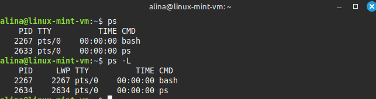
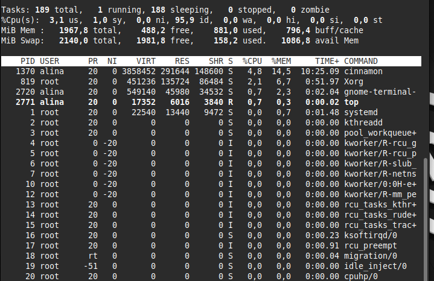
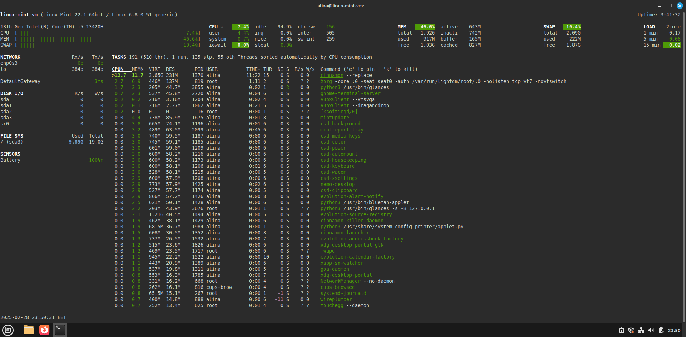

# Лабораторна робота №4

**Тема:** Команди Linux для управління процесами

**Мета роботи:**

1. Отримання практичних навиків роботи з командною оболонкою Bash.
2. Знайомство з базовими командами для управління процесами.

**Матеріальне забезпечення занять:**

1. ЕОМ типу IBM PC;
2. ОС сімейства Windows та віртуальна машина Virtual Box (Oracle);
3. ОС GNU/Linux (будь-який дистрибутив);
4. Сайт мережевої академії Cisco netacad.com та його онлайн курси по Linux.

**Виконували:**

- Машовець Аліна
- Шурубор Назар

## Завдання для попередньої підготовки

1. \*Прочитайте короткі теоретичні відомості до лабораторної роботи та зробіть невеличкий словник базових англійських термінів з питань призначення команд та їх параметрів.

2. На базі розглянутого матеріалу дайте відповіді на наступні питання:
    1. \*Які команди для моніторингу стану процесів ви знаєте. Як переглянути їхні можливі параметри?
        - `ps` - report a snapshot of the current processes

        | Parameter   | Description                                                                  |
        |-------------|------------------------------------------------------------------------------|
        | -A          | Shows all processes                                                          |
        | -N          | Shows the opposite of the specified parameters                               |
        | -a          | Shows all processes except session headers and processes without a terminal  |
        | -d          | Shows all processes except session headers                                   |
        | -e          | Shows all processes                                                          |
        | -C cmslist  | Shows processes contained in the list cmdlist                                |
        | -G grplist  | Shows processes with a group ID listed in grplist                            |
        | -U userlist | Shows processes owned by a userid listed in userlist                         |
        | -g grplist  | Shows processes by session or by groupid contained in grplist                |
        | -p pidlist  | Shows processes with PIDs in the list pidlist                                |
        | -s sesslist | Shows processes with session ID in the list sesslist                         |
        | -t ttylist  | Shows processes with terminal ID in the list ttylist                         |
        | -u userlist | Shows processes by effective userid in the list userlist                     |
        | -F          | Uses extra full output                                                       |
        | -O format   | Displays specific columns in the list format, along with the default columns |
        | -M          | Displays security information about the process                              |
        | -c          | Shows additional scheduler information about the process                     |
        | -f          | Displays a full format listing                                               |
        | -j          | Shows job information                                                        |
        | -l          | Displays a long listing                                                      |
        | -o format   | Displays only specific columns listed in format                              |
        | -y          | Prevents display of process flags                                            |
        | -Z          | Displays the security context information                                    |
        | -H          | Displays processes in a hierarchical format (showing parent processes)       |
        | -n namelist | Defines the values to display in the WCHAN column                            |
        | -w          | Uses wide output format, for unlimited width displays                        |
        | -L          | Shows process threads                                                        |
        | -V          | Displays the version of ps                                                   |

        

        - `top` - display Linux processes

        | Parameter | Description                                                                                       |
        |-----------|---------------------------------------------------------------------------------------------------|
        | -b        | Batch mode: Operate in batch mode. Useful for scripting                                           |
        | -c        | Command line/program name toggle: Toggle between displaying the command line and the program name |
        | -d        | Delay time: Change the delay between screen updates                                               |
        | -E        | Extended mode: Provides more detailed information                                                 |
        | -e        | Errors: Display errors encountered by top                                                         |
        | -H        | Threads: Show individual threads                                                                  |
        | -h        | Help: Display help screen                                                                         |
        | -i        | Idle processes: Do not display idle or zombie processes                                           |
        | -n        | Iterations: Number of iterations before exiting                                                   |
        | -O        | Output fields: Specify output fields                                                              |
        | -o        | Order fields: Specify the order of output fields                                                  |
        | -p        | PID: Monitor only listed process IDs                                                              |
        | -S        | Cumulative time mode: Toggle cumulative time mode                                                 |
        | -s        | Secure mode: Run in secure mode (disables some interactive commands)                              |
        | -U        | User: Monitor processes for a specific user                                                       |
        | -u        | User: Monitor processes for a specific user                                                       |
        | -v        | Version: Display version information                                                              |
        | -w        | Window mode: Run in window mode                                                                   |
        | -1        | Single/separate CPUs: Toggle between showing a single CPU summary and separate CPU summaries      |
        | <space>   | Force an immediate screen refresh                                                                 |

        

        - `glances` - a relatively new system monitoring tool with advanced functionality; an eye on your system

        | Parameter | Description                                           |
        |-----------|-------------------------------------------------------|
        | -h        | Show the help message                                 |
        | -v        | Show the version of Glances                           |
        | -c        | Connect to a Glances server at the specified IP       |
        | -s        | Start Glances in server mode                          |
        | -w        | Run Glances as a web server                           |
        | -t        | Set the refresh rate in seconds (default is 1 second) |
        | -f        | Specify a configuration file                          |
        | -B        | Bind server/web server to a specific address          |
        | -p        | Set the server/web server port                        |

        

    2. \*Чи може команда ps у реальному часі відслідковувати стан процесів?
        No, the ps command cannot track processes in real time. It only takes a snapshot of the process status at the moment the command is executed.
    3. \*\*За якими параметрами можливе сортування процесів в команді top? Як переключатись між ними?
        In the `top` command, processes can be sorted by different parameters using hotkeys

        | Hotkey | Sort by        |
        |--------|----------------|
        | P      | CPU usage      |
        | M      | memory usage   |
        | N      | process ID     |
        | T      | total CPU time |
        | C      | command name   |

    4. \*\*Які команди для завершення роботи процесів ви знаєте?

        - `kill` - sends a signal to a process, most commonly used to terminate it by its process ID;
        - `pkill` - terminates processes by their name or other attributes;
        - `killall` - kills all processes with a specified name;
        - `xkill` - kills a graphical program by clicking on its window.

3. Прочитати матеріал про роботу з процесами у терміналі:
    - [Процеси в Linux. Управління процесами](https://acode.com.ua/processes-in-linux/)
    - [Find out what processes are running in the background on Linux](https://www.cyberciti.biz/faq/find-out-what-processes-are-running-in-the-background-on-linux/)

4. Підготувати в електронному вигляді початковий варіант звіту:
    - Титульний аркуш, тема та мета роботи
    - Словник термінів
    - Відповіді на п.2.1-2.4 з завдань для попередньої підготовки

## Хід роботи

1. Початкова робота в CLI-режимі в Linux ОС сімейства Linux:

    1. Запустіть операційну систему Linux Ubuntu. Виконайте вхід в систему та запустіть термінал _(якщо виконуєте ЛР у 401 ауд.)_;
    2. Запустіть віртуальну машину Ubuntu_PC _(якщо виконуєте завдання ЛР через академію netacad)_;
    3. Запустіть свою операційну систему сімейства Linux _(якщо працюєте на власному ПК та її встановили)_ та запустіть термінал.

2. Дайте відповіді на наступні питання:

    - Як вивести вміст директорії `/proc`? Де вона знаходиться та для чого призначена? Охарактеризуйте інформацію про її вміст?
    - Як вивести інформацію про поточні сеанси користувачів. Якою командою це можна зробити?
    - Які дії можна зробити в терміналі за допомогою комбінацій Ctrl + C, Ctrl + D та Ctrl + Z?
    - \*Чим відрізняється фоновий процес від звичайного. Де вони використовуються?
    - \*Опишіть наступні команди та поясніть що вони виконують – команда `jobs`, `bg`, `fg`.
    - \*\*Якою командою можна переглянути інформацію про запущені в системи фонові процеси та задачі?
    - \*\*Як призупинити фоновий процес, як його потім відновити та при необхідності перезапусти?

3. Запустіть термінал, та в командному рядку виконайте наступні дії для ознайомлення з роботою з процесами:

    - запустіть команду `top`, проаналізуйте отриманий в цій команді результат та охарактеризуйте найбільш активні процеси у системі;
    - призупинити виконання команди `top` (треба використати комбінацію клавіш);
    - вивести інформацію про процеси за допомогою команди `ps`;
    - \*наведіть 5 прикладів з використанням різних параметрів команди `ps` _(наприклад, вивести тільки системні процеси, вивести процеси конкретного користувача, вивести дерево процесів тощо)_. Опишіть, що саме роблять обрані Вами параметри;
    - \*\*передивіться чи є у Вас запущені фонові процеси, які саме?
    - \*\*відновити виконання призупиненого фонового процесу спочатку у позиції "на передньому плані" _(foreground)_, потім ще раз його призупинити, а потім відновити його виконання у позиції "на задньому плані" _(background)_;
    - завершити роботу даного фонового процесу.

## Контрольні запитання

1. Яке призначення директорії `/proc` в системах Linux. Яку інформацію вона зберігає?
2. Як серед будь-яких трьох процесів динамічно визначати, який з них в поточний момент часу використовує найбільший обсяг пам'яті? Який відсоток пам’яті він споживає від загального обсягу?
3. Як отримати ієрархію батьківських процесів в системах Linux? Наведіть її структуру та охарактеризуйте.
4. \*Чим відрізняється команда `top` від `ps`?
5. \*Які додаткові можливості реалізує `htop` в порівнянні з `top`?
6. \*\*Опишіть компоненти вашої мобільної ОС для здійснення моніторингу запущених в системі процесів?
7. \*\*Чи підтримує Ваша мобільна ОС термінальне керування роботою процесів, опишіть як саме.
8. \*\*Чи можливо поставити сторонні програмні засоби, що дозволяють організувати управління та моніторинг роботою процесів у Вашому мобільному телефоні. Коротко опишіть їх.

## Висновки
