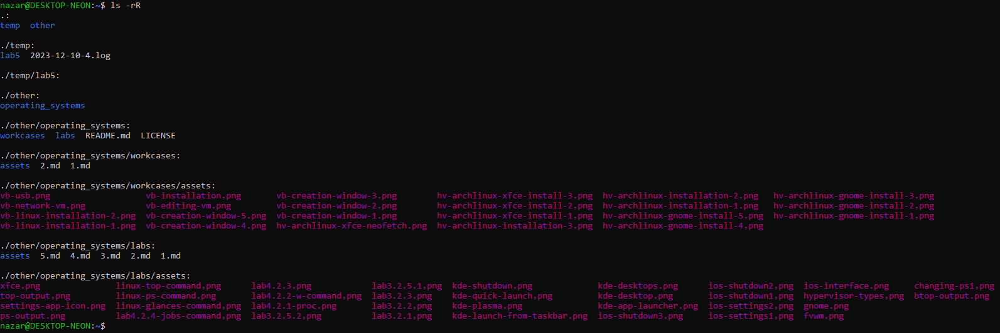

# Лабораторна робота №5

**Тема:** Знайомство з командами навігації по файловій системі та керування файлами та каталогами

**Мета роботи:**

1. Отримання практичних навиків роботи з командною оболонкою Bash.
2. Знайомство з базовими командами навігації по файловій системі.
3. Знайомство з базовими командами для керування файлами та каталогами.

**Матеріальне забезпечення занять:**

1. ЕОМ типу IBM PC;
2. ОС сімейства Windows та віртуальна машина Virtual Box (Oracle);
3. ОС GNU/Linux (будь-який дистрибутив);
4. Сайт мережевої академії Cisco netacad.com та його онлайн курси по Linux.

**Виконували:**

- Машовець Аліна
- Шурубор Назар

## Завдання для попередньої підготовки

1. \*Прочитайте короткі теоретичні відомості до лабораторної роботи та зробіть невеликий словник базових англійських термінів з питань призначення команд та їх параметрів.

    | Term      | Meaning                                                                       |
    |-----------|-------------------------------------------------------------------------------|
    | Directory |  file system that is used to store all files and directories on a computer    |
    | `.`       |  Shortcut representing the current directory                                  |
    | `..`      |  Shortcut representing one directory higher relative to the current directory |
    | cd        |  Command that changes the working directory                                   |
    | home      |  Each user typically has a home directory where they have full control to create and delete files and directories |
    | recursive listings | Displays all files in a directory as well as all files in all subdirectories in the directory. Accomplished using the -R option to the ls command |
    | ~         | Shortcut representing the home directory                                      |
    | cp        | Command used to copy files                                                    |
    | mkdir     | Command used to create directories                                            |
    | mv        | Command used to move and/or rename files                         |
    | rm        | Command used to remove files or directories                                        |
    | rmdir     | Command used to remove directories                                  |
    | touch     | Command used to create empty files                                            |

2. На базі розглянутого матеріалу дайте відповіді на наступні питання:

    1. Порівняйте файлові структури Windows-подібної та Linux-подібної системи.

        Windows' file system at the root level has drives. Like, commonly the drive with the system files will be
        called the `C:` drive.
        Linux file system stores everything under the root directory (`/`). For example devices are stored `/dev`
        as special files.

    2. \*Розкрийте поняття FHS. Як даний стандарт використовується в контексті файлових систем?

        FHS stands for Filesystem Hierarchy Standard. It is a standard that defines the directory structure and
        directory contents in Unix-like operating systems, such as Linux. FHS outlines where files and directories
        should be located and what they should contain. It ensures consistency across different Linux distributions,
        making it easier for software developers, system administrators, and users to understand the file system layout.

        **Main Directories Defined by FHS:**
        `/bin` – essential user binaries (e.g., ls, cp)
        `/sbin` – essential system binaries (e.g., fsck, reboot)
        `/etc` – configuration files
        `/usr` – secondary hierarchy for read-only user data; contains most user commands
        `/var` – variable data (e.g., logs, spool files)
        `/home` – user home directories
        `/tmp` – temporary files
        `/lib` – essential shared libraries

    3. \*\*Перерахуйте основні команди для роботи з файлами та каталогами в Linux: створення, переміщення, копіювання, видалення.

        **The primary commands for working with the file system are:**
        - `cd`: changing directories;
        - `ls`: listing files and directories in the current (working) directory;
        - `touch`: creating an empty file;
        - `mkdir`: creating an empty directory;
        - `mv`: moving one or multiple files or directories;
        - `rm`: removing one or multiple files or directories;
        - `cp`: copying one or multiple files or directories.

3. Вивчіть матеріали онлайн-курсу академії Cisco “NDG Linux Essentials”:
    - Chapter 7 - Navigating the Filesystem
    - Chapter 8 - Managing Files and Directories

4. Пройдіть тестування у курсі NDG Linux Essentials за такими темами:
    - Chapter 07 Exam
    - Chapter 08 Exam

5. Підготувати в електронному вигляді початковий варіант звіту:
    - Титульний аркуш, тема та мета роботи
    - Словник термінів
    - Відповіді на п.2.1-2.3 з завдань для попередньої підготовки

## Хід роботи

1. Початкова робота в CLI-режимі в Linux ОС сімейства Linux:
    - Запустіть операційну систему Linux Ubuntu. Виконайте вхід в систему та запустіть термінал _(якщо виконуєте ЛР у 401 ауд.)_.
    - Запустіть віртуальну машину Ubuntu_PC _(якщо виконуєте завдання ЛР через академію netacad)_.
    - Запустіть свою операційну систему сімейства Linux _(якщо працюєте на власному ПК та її встановили)_ та запустіть термінал.

2. Опрацюйте всі приклади команд, що представлені у лабораторних роботах курсу _NDG Linux Essentials - Lab 7: Navigating the Filesystem_ та _Lab 8: Managing Files and Directories_. Створіть таблицю для опису цих команд.

    | Назва команди         | Її призначення та функціональність                            |
    | --------------------- | ------------------------------------------------------------- |
    | `pwd`                 | Визначає місце знаходження користувача у файловій системі, показує поточну робочу директорію (print working directory) |
    | `cd Documents`        | Команда cd здійснює перехід до каталогу, який у неї вказаний як аргумент. В даному випадку це каталог Documents |

    > **Примітка:** Скріншоти виконання команд в терміналі можна не представляти, достатньо коротко описати команди в таблиці

3. Робота в в терміналі _(закріплення практичних навичок)_ обов'язково представити свої скріншоти:

    - Визначте ваш поточний робочий каталог;

        ```bash
        $ pwd
        /home/nazar/temp/lab5
        ```

    - Перейдіть до кореневого каталогу та визначте Ваш поточний робочий каталог (дві команди);

        ```bash
        $ cd ~
        $ pwd
        /home/nazar
        ```

    - Перегляньте вміст поточного каталогу у довгому форматі _(скористайтесь відповідним ключем команди `ls`)_;

        ```bash
        $ ls -l
        total 8
        drwxr-xr-x 4 nazar nazar 4096 Mar 26 19:47 other
        drwxr-xr-x 3 nazar nazar 4096 Mar 26 19:47 temp
        ```

    - Перейдіть до каталогу `/usr/share` та визначте Ваш поточний робочий каталог _(дві команди)_;

        ```bash
        $ cd /usr/share
        $ pwd
        /usr/share
        ```

    - Перегляньте вміст поточного каталогу включаючи і приховані файли _(hidden files) (скористайтесь відповідним ключем команди `ls`)_;

        ```bash
        ls -a
        ```

        

    - \*Перейдіть до каталогу `/etc`;

        ```bash
        cd /etc
        ```

    - \*Перегляньте вміст даного каталогу, але щоб виводило тільки назви файлів, що починаються з літери вашого імені;

        ```bash
        $ ls -d [Aa]*
        adduser.conf  alternatives  apache2  apparmor  apparmor.d  apport  apt
        $ ls -d [Nn]*
        nanorc  netconfig  netplan  networkd-dispatcher  networks  newt  nsswitch.conf
        ```

        To not display the contents of directories we add the `-d` option.
        The command outputs a list of files (and directories) starting with `N` or `n` and then `A` or `a`.
        In Linux files are usually named in lower-case, so there are no files starting with upper-case letters.

    - \*Перегляньте вміст даного каталогу, але щоб виводило тільки файли, назви яких складаються з 6 літер;

        ```bash
        $ ls -d ??????
        apport  cron.d  dbus-1  gnutls  group-  init.d  kernel  nanorc  passwd  shadow  shells  subgid  subuid  vulkan  wgetrc
        ```

    - \*\*Перегляньте вміст даного каталогу, але щоб виводило тільки файли, назви яких закінчуються на літери ваших імен, наприклад якщо ваші імена Ivan, Anna, Maks, то вибірку робиму, щоб назви файлів закінчувались на літери [`i`,`a`,`m`];

        ```bash
        $ ls -d *[na]
        bash_completion  debian_version  locale.gen  netplan  vulkan
        ```

    - \*\*Перейдіть до домашнього каталогу поточного користувача та перегляньте його вміст у рекурсивному _(зворотному до алфавітного)_ форматі _(виконати цю дію через конвеєр команд)_;

        ```bash
        ls -rR
        ```

        Where `-r` sorts the files in reversed alphabetical order and `-R` lists the directories recursively.

        

    - В поточній директорії створити директорію з назвою вашої групи;  

        ```bash
        mkdir scio-me-nihil-scire
        ```

    - Переглянути оновлений вміст домашнього каталогу поточного користувача. Скористайтесь ключем `-r` команди `ls`, яку інформацію ви отримаєте?

        ```bash
        $ ls -r
        temp  scio-me-nihil-scire  other
        ```

        The `-r` sorts the files in reversed alphabetical order (from `Z` to `A`).

    - Перейдіть у створену вами директорію з назвою Вашої групи та створіть у ній порожній файл `lab5`;

        ```bash
        cd scio-me-nihil-scire
        touch lab5
        ```

    - Створити в даній директорії 3 директорії з прізвищами студентів вашої команди `surname1`, `surname2`, `surname3` _(команда `mkdir` мульти аргумента, тому всі три каталоги можна створити однією командою)_;

        ```bash
        mkdir mashovets shurubor
        ```

    - Перейдіть у перший підкаталог `surname1` та створіть порожній файл з ім'ям першого студента `name1`;  

        ```bash
        cd mashovets/
        touch alina
        ```

    - За допомогою команди `echo "Hello, my name is Name1" > name1` внесіть у цей файл дані про студента _(символ > дозволяє вивід команди echo перенаправити одразу у файл name1)_;

        ```bash
        echo "Hello, my name is Alina" > alina
        ```

    - Перегляньте вміст файлу `name1` за допомогою команди `cat name1` _(має містити щойно введену Вами інформацію)_;

        ```bash
        $ cat alina
        Hello, my name is Alina
        ```

    - Зробіть копію першого файлу `name1` та перейменуйте її у файл з другим ім'ям студенту Вашої команди `name2`;

        ```bash
        cp alina nazar
        ```

    - Перегляньте вміст каталогу, обидва файли мають з'явитися;

        ```bash
        $ ls
        alina  nazar
        ```

    - Перегляньте вміст другого файлу `cat name2` _(він має поки що містити повну копію вмісту файлу `name1`)_;

        ```bash
        $ cat nazar
        Hello, my name is Alina
        ```

    - Замініть зміст файлу `name2`, щоб він містив відповідне ім'я другого студента за допомогою команди `echo "Hello, my name is Name2" > name2`;

        ```bash
        echo "Hello, my name is Nazar" > nazar
        ```

    - Перегляньте вміст другого файлу `cat name2` _(він вже має містити оновлену інформацію)_;

        ```bash
        $ cat nazar
        Hello, my name is Nazar
        ```

    - Перемістіть файл `name2` у директорію `surname2`;

        ```bash
        mv nazar ../shurubor/
        ```

    - Зробіть копію першого файлу `name1` та перейменуйте її у файл з третім ім'ям студенту Вашої команди `name3`;
    - Перемістіть файл `name3` у директорію `surname3`;
    - Перейдіть до директорії `surname3`;
    - Перегляньте вміст третього файлу командою `cat name3` _(він має містити дані про другого студента)_;
    - Замініть зміст файлу `name3`, щоб він містив відповідне ім'я третього студента за допомогою команди `echo "Hello, my name is Name3" > name3`;
    - Перегляньте вміст файлу за допомогою `cat name3` _(він вже має містити оновлену інформацію)_;
    - Поверніться до домашнього каталогу користувача;

        ```bash
        cd ~
        ```

    - \*\*Перегляньте вміст даного каталогу, але щоб виводило тільки Ваш підкаталог з назвою групи та весь його вміст _(підкаталоги `surname1`, `surname2`, `surname3` та файли `name1`, `name2`, `name3`)_ до того ж файли та каталоги були відкоремлені кольорами (скористайтесь відповідним ключем `-R` команди `ls` та не забудьте використати спеціальний glob-шаблон [імʼя каталогу])

        ```bash
        ls -R --color=auto scio-me-nihil-scire
        ```

        

        > In our environment the `ls` command by default color-codes the output, so the `--color=auto` option is unnecessary.

    > **Примітка:** Назви підкаталогів `surname1`, `surname2`, `surname3` та файлів `name1`, `name2`, `name3` замініть на свої

4. Опишіть дії, які виконують команди для переміщення по системі каталогів:

    - команда `cd /` - cd into the root directory;
    - команда `cd /home` - cd into `/home` directory (the one where users' files are);
    - команда `cd ~` - short for `/home/$(whoami)`, where `$(whoami)` is the username of a current user (ex.: `/home/alina`);
    - команда `cd` (без аргумента) - same as `cd ~`;
    - команда `cd ..` - cd into the parent directory;
    - команда `cd ../..` - cd into the directory two levels up;
    - команда `cd -` - prints the previously used directory and changes to it.

## Контрольні запитання

1. Як можна переглянути шлях до домашньої директорії користувача за допомогою команди echo? Існує 2 способи, наведіть обидва приклади у терміналі _(відповідь є у матеріалах академії cisco на сайті netacad.com)_

    Спосіб 1:

    ```bash
    echo $(pwd)
    ```

    Спосіб 2:

    ```bash
    echo `pwd`
    ```

2. \*Чи можна переглянути вміст кореневого каталогу, перебуваючи у домашньому каталозі користувача без переходу у кореневий каталог? Продемонструйте це в командному рядку.

    Yes, of course. It actually doesn't even matter which directory we're in. The command would be:

    ```sh
    cd /
    ```

3. \*Яким чином в терміналі можна додати інформацію в порожній файл?

    Either using a text editor like `vim` or `nano`, or using output redirection:

    ```sh
    echo "Information" > file.txt
    ```

4. \*\*Як скопіювати та видалити існуючий каталог? Чи буде відмінність в командах, якщо каталог буде не порожній при цьому

    The following commands will copy the directory and delete the old one no matter if it's empty or not:

    ```bash
    cp -r source_directory destination_directory
    rm -r source_directory
    ```

5. \*\*У якому з наведених нижче прикладів відбувається переміщення файлу? його перейменування? одночасно обидві дії?

    - `mv /work/tech/comp.png. /Desktop`

        This command moves the file `comp.png.` from the `/work/tech/` directory to the `/Desktop` directory without renaming.
        The file's new path will be `/Desktop/comp.png.`.

    - `mv /work/tech/comp.png. /work/tech/my_car.png`

        This command only renames the file `comp.png.` to `my_car.png` as both the source and the destination directories are the same.
        The file's new path will be `/work/tech/my_car.png`.

    - `mv /work/tech/comp.png. /Desktop/computer.png`

        This command both renames the file from `comp.png.` to `computer.png` and moves it from the `/work/tech/` directory to `/Desktop/`.
        The file's new path will be `/Desktop/computer.png`.

## Висновки
