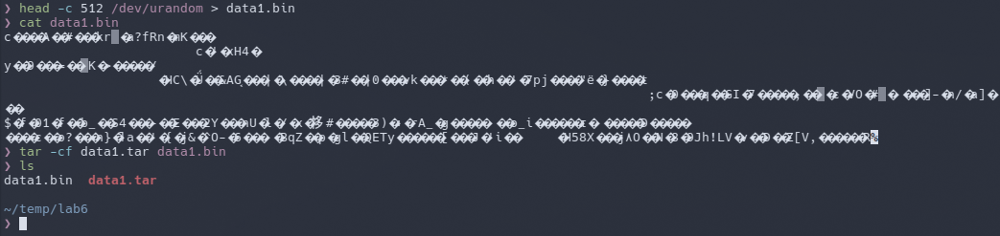
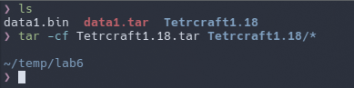
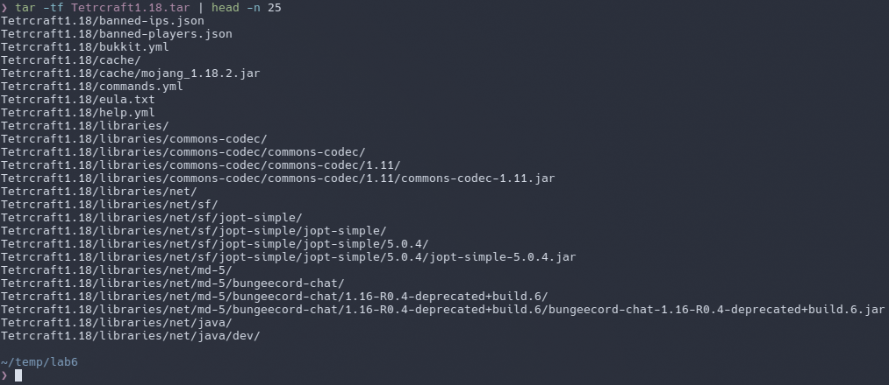
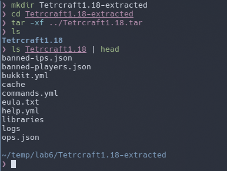
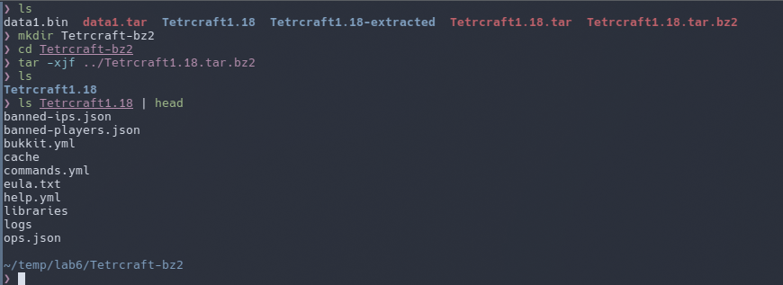

# Лабораторна робота №6

**Тема:** Команди Linux для архівування та стиснення даних. Робота з текстом

**Мета роботи:**

1. Отримання практичних навиків роботи з командною оболонкою Bash.
2. Знайомство з базовими командами для архівування та стиснення даних.
3. Знайомство з базовими діями при роботі з текстом у терміналі.

**Матеріальне забезпечення занять:**

1. ЕОМ типу IBM PC;
2. ОС сімейства Windows та віртуальна машина Virtual Box (Oracle);
3. ОС GNU/Linux (будь-який дистрибутив);
4. Сайт мережевої академії Cisco netacad.com та його онлайн курси по Linux.

**Виконували:**

- Машовець Аліна
- Шурубор Назар

## Завдання для попередньої підготовки

1. \*Прочитайте короткі теоретичні відомості до лабораторної роботи та зробіть невеликий словник базових англійських термінів з питань призначення команд та їх параметрів.

2. Вивчіть матеріали онлайн-курсу академії Cisco “NDG Linux Essentials”:
    - Chapter 09 - Archiving and Compression
    - Chapter 10 - Working With Text

3. Пройдіть тестування у курсі NDG Linux Essentials за такими темами:
    - Chapter 09 Exam
    - Midterm Exam (Modules 1 - 9)
    - Chapter 10 Exam

4. На базі розглянутого матеріалу дайте відповіді на наступні питання:
    1. \*Яке призначення команд  tar, xz, zip, bzip, gzip? Зробіть короткий опис кожної команди та виділіть їх основні параметри. Яким чином їх можна встановити.
    2. \*\*Наведіть три приклади реалізації архівування та стискання даних різними командами.
    3. \*Яке призначення команд  cat, less, more, head and tail? Зробіть короткий опис кожної команди та виділіть їх основні параметри. Яким чином їх можна встановити
    4. \*\*Поясніть принципи роботи командної оболонки з каналами, потоками та фільтрами
    5. \*Яке призначення команди grep?

5. Підготувати в електронному вигляді початковий варіант звіту:
    - Титульний аркуш, тема та мета роботи
    - Словник термінів
    - Відповіді на п.4.1 та п.4.5 з завдань для попередньої підготовки

## Хід роботи

1. Початкова робота в CLI-режимі в Linux ОС сімейства Linux:
    - Запустіть операційну систему Linux Ubuntu. Виконайте вхід в систему та запустіть термінал (якщо виконуєте ЛР у 401 ауд.).
    - Запустіть віртуальну машину Ubuntu_PC (якщо виконуєте завдання ЛР через академію netacad)
    - Запустіть свою операційну систему сімейства Linux (якщо працюєте на власному ПК та її встановили) та запустіть термінал.

2. Опрацюйте всі приклади команд, що представлені у лабораторних роботах курсу NDG Linux Essentials - Lab 9: Archiving and Compression та Lab 10: Working With Text. Створіть таблицю для опису цих команд

    | Назва команди | Її призначення та функціональність |
    | ------------- | ---------------------------------- |
    | `mkdir mybackups` | Створення нової директорії `mybackups` у домашньому каталозі користувача |
    | `tar -cvf mybackups/udev.tar /etc/udev` | Команда `tar` використовується для об’єднання кількох файлів в один файл. В даному випадку вміст директорії `/etc/udev` буде збережено в архів `udev.tar` у директорії `mybackups`. Параметр `-c` повідомляє команді `tar` створити файл `tar`. Параметр `-v` означає "verbose", який наказує команді `tar` продемонструвати, що вона робить. Параметр `-f` використовується для вказівки назви файлу `tar`. |

    > **Примітка:** Скріншоти виконання команд в терміналі можна не представляти, достатньо коротко описати команди в таблиці.

3. Ознайомтесь з командою tar та за її допомогою виконати у терміналі наступні дії:

    - створити файл з розширенням `.tar`;

        First, we're going to create a file `data1.bin` filled with random bytes generated by the `/dev/urandom` device.
        For this we're going to use the `head` command and output redirection:

        ```sh
        head -c 512 /dev/urandom > data1.bin
        ```

        And now to create the tarball we're going to use the following command:

        ```sh
        tar -cf data1.tar data1.bin
        ```

        The argument `-c` tells the `tar` command to create a new tarball, and the
        `-f` argument tells it how to name the output file. After that we give a list
        of files and directories to include in the tarball.

        Now we have a tarball `data1.tar`, that contains `data1.bin`!

        

    - створити файл з розширенням `.tar`, що складається з декількох файлів і каталогів одночасно;

        For this task I have a Minecraft server in a folder `Tetrcraft1.18`, that we're going to back up.
        To make a tarball from the folder we're going to use the same command:

        ```sh
        tar -cf Tetrcraft1.18.tar Tetrcraft1.18/*
        ```

        

    - перегляду вмісту файлу;

        To view the contents of the tarball we're going to use the `-t` argument, that lists out all the files inside.
        But since there is an entire server inside of the tarball we will pipe the output into `head` to get only the
        first few files, just to make sure they are there.

        ```sh
        tar -tf Tetrcraft1.18.tar | head -n 25
        ```

        

    - витягти вміст файлу `tar`;

        Just to play around let's extract the contents of the jsut created tarball into a new folder.
        Firstly we need to create that folder, let's say `Tetrcraft1.18-extracted`. After that we `cd` and run the
        extraction command:

        ```sh
        mkdir Tetrcraft1.18-extracted
        cd Tetrcraft1.18-extracted
        tar -xf ../Tetrcraft1.18.tar
        ```

        

    - створити архівний файл `tar`, стиснений за допомогою `bzip`;

        Creating an archive tarball is as simple as adding just one more argument to the command.
        To archive using `bzip2` we need to add the `-j` argument. So the command to create an archive will be:

        ```sh
        tar -cjf Tetrcraft1.18.tar.bz2 Tetrcraft1.18/*
        ```

    - витягти вміст файлу `tar` `bzip`;

        Same thing as the extracting a regular tarball, but we just add the `-j` argument:

        ```sh
        mkdir Tetrcraft-bz2
        cd Tetrcraft-bz2
        tar -xjf ../Tetrcraft1.18.tar.bz2
        ```

        

        > Interesting thing to note here is that archiving and extracting took much more time now, since
        > there are much more calculations involved. For example, creating the archive took me 13 seconds.

    - створити архівний `tar` файл, стисненого за допомогою `gzip`;

        Same as in the previous chapter, but intead of the `-j` argument we use `-z`.
        So the command will be:

        ```sh
        tar -czf Tetrcraft1.18.tar.gz Tetrcraft1.18/*
        ```

    - витягти вміст файлу `tar` `gzip`.

        That would be:

        ```sh
        tar -xzf Tetrcraft1.18.tar.gz
        ```

4. \*Як буде відбуватись перенаправлення потоків виведення в `bash` для наступних дій з командами (позначено як `cmd`) та файлами (позначено як `file`):

    | Команда                | Що виконує команда?                                                                                                        |
    | ---------------------- | -------------------------------------------------------------------------------------------------------------------------- |
    | `cmd 1> file`          | Redirects stdout to the file, overwriting its contents.                                                                    |
    | `cmd > file`           | Same as previous command.                                                                                                  |
    | `cmd 2> file`          | Redirects stderr to the file, overwriting its contents.                                                                    |
    | `cmd >> file`          | Redirects stdout to the file, appending to the end.                                                                        |
    | `cmd &> file`          | Redirects both stdout and stderr to file, overwriting its contents.                                                        |
    | `cmd > file 2>&1`      | Redirects stdout to file, then redirects stderr to the same file stream.                                                   |
    | `cmd >> file 2>&1`     | Appends stdout to file, then redirects stderr to that same append stream.                                                  |
    | `cmd 2>&1 > /dev/null` | Redirects stderr to the original stdout (the terminal), then sends stdout to `/dev/null`, so only errors appear on screen. |
    | `cmd 2> /dev/null`     | Redirects stderr to `/dev/null`, discarding all error messages; stdout still goes to screen.                               |
    | `cmd1 \| cmd2`         | Pipes stdout of `cmd1` into stdin of `cmd2`; stderr of `cmd1` still goes to screen.                                        |
    | `cmd1 2>&1 \| cmd2`    | Merges stderr into stdout for `cmd1`, then pipes both streams into `cmd2`’s stdin.                                         |

5. **Розгляньте наведені нижче приклади та поясніть, що виконують дані команди та який тип перенаправлення потоків вони використовують:

    | Команда                                      | Що виконує команда? | Який потік перенаправлення? |
    | -------------------------------------------- | ------------------- | --------------------------- |
    | `echo "It is a new story." > story`          | Writes `It is a new story.` into the file `story`. | Redirects stdout to `story` (overwrite). |
    | `date > date.txt`                            | Writes the current date and time into file `date.txt` | Redirects stdout of command `date` to `date.txt` (overwrite). |
    | `cat file1 file2 file3 > bigfile`            | Concatenates the contents of `file1`, `file2`, and `file3`, then writes the combined data into `bigfile`. | Redirects stdout to `bigfile` (overwrite). |
    | `ls -l >> directory`                         | Appends the long-format directory listing to the file named directory (creating it if needed). | Redirects stdout to `directory` (append). |
    | `sort < file1_unsorted > file2_sorted`       | Reads lines from `file1_unsorted`, sorts them, and writes the sorted output into `file2_sorted`. | Redirects stdin from `file1_unsorted`; stdout to `file2_sorted` (overwrite). |
    | `find -name '*.txt' > file.txt 2> /dev/null` | Finds all .txt files and writes the list into `file.txt`, while discarding any error messages. | stdout to `file.txt`, stderr to `/dev/null`. |
    | `cat file1_unsorted \| sort > file2_sorted`  | Pipes the raw contents of `file1_unsorted` into sort, then writes the sorted result into `file2_sorted`. | stdout of `cat` piped into `sort`; stdout of `sort` into `file2_sorted` |
    | `cat myfile \| grep student \| wc -l`        | Streams `myfile` through `grep` to filter lines containing "student", then counts those lines with `wc -l`. | stdout of each command piped to the next (a chain of pipes) |

## Контрольні запитання

1. Надайте порівняльну характеристику процесам стискання та архівування.

    Compression is the process of reducing the size of files by encoding their data more efficiently. Tools such as gzip, bzip2, xz, and 7z are commonly used for this purpose. Each tool varies in terms of compression ratio and speed.
    Archiving, on the other hand, is the process of combining multiple files and directories into a single file without necessarily reducing their size. It’s mainly used for easier storage, backup, or transfer. Tools like `tar` are used for archiving. The resulting archive retains the structure and content of the original files, making it convenient to manage large sets of data.
    These processes are often used together — for example, using `tar` to archive a directory and then `gzip` to compress the archive, resulting in a `.tar.gz` file. In this way, users benefit from both organization and size reduction. While archiving is usually fast, the overall speed and efficiency of the combined process depend heavily on the chosen compression method.

2. Які програми, окрім наведених в роботі, можуть використовуватись для стискання та архівування файлів та каталогів в ОС Linux? Наведіть приклади та їх короткий опис.

    `gzip` and `gunzip` can be used for compressing and decompressing files, together with `tar` they can be used to compress and archive files. Similarly `bzip2` and `bunzip2` can be used, however `bzip2` is more effective, but slower compared to `gzip`.
    `xz` and `unxz` offer even better compression ratios than bzip2, but are typically slower in both compression and decompression. They are commonly used for distributing large source code archives in formats like `.tar.xz`.
    For combining compression and archiving in one step, tools like `zip` and `unzip` are often used. Unlike `tar`, which only archives by default, `zip` compresses each file individually inside the archive. It’s widely supported on both Linux and Windows systems.
    Another powerful utility is `7z`, which supports high compression ratios and multiple formats like `.7z`, `.zip`, and `.tar`.

3. \*Порівняйте алгоритми стискання, що використовуються в командах (програмах), використовуваних в Linux. Які з алгоритмів можна вважати найшвидшим та найефективнішим?

    `gzip` uses the DEFLATE algorithm, which is very fast and provides moderate compression. It’s ideal when speed is more important than maximum file size reduction.
    `bzip2` uses the Burrows-Wheeler algorithm, offering better compression than `gzip`, especially for larger files, but it is significantly slower in both compression and decompression.
    `xz` uses the LZMA2 algorithm, which achieves some of the highest compression ratios among commonly used tools. However, it is also the slowest, especially when using the highest compression levels.
    `zip`, like `gzip`, uses DEFLATE, but compresses files individually inside the archive, which can result in slightly less efficient compression for many small files compared to tar-based approaches.
    `7z` used the LZMA/LZMA2 algorithms and provides excellent compression and supports various tuning options, including multithreaded compression, making it more flexible and efficient on modern systems.

4. \*Опишіть програмні засоби для стискання та архівування, що можуть бути використані у вашому мобільному телефоні.

    On iOS the Apple's Files app has functionality of creating `.zip` compressed archives and unzipping them.

5. \*Опишіть та порівняйте програмні засоби для стискання та (де)архівування даних у ОС сімейства Windows.

    On Windows the two most common archiving/compressing tools are WinRAR and 7zip, however with the release of Windows 11
    the support of `.zip` archives also came to the default File Manager app.

    WinRAR is proprietary and requires a licence for commercial use, but 7zip is free and open source
    under the GNU LGPL licence. 7zip does appear to be a little more unstable and buggy compared to
    WinRAR, but it gets the job done.

6. \*\*Поясніть яким чином стиснення та архівування даних може бути використано для резервування даних. В яких ще задачах системного адміністрування воно може бути використано.

    Compressed archives are really just perfect for storing backups of files and data. They are easy to work with since it's
    just one singular file in the result and it saves on data when transferring since it's compressed. Compressed archives
    are used far from only in sysadmin's tasks. For example, software is usually distributed in such archives. MacOS
    applications and their `.app` files are literally just archives. Linux packages like `.deb` or `.rpm` are also archives.
    Archives also could be used in gaming, for example the game _osu!_ distributes additional maps in a `.osz` which are
    compressed archives. One more interesting example is the Minecraft network protocol uses `zlib` compression for data
    in transfer (if enabled by the server) to save bandwidth.

7. \*\*Яке призначення директорії файлу `/dev/null`?

    The special file `/dev/null` in Linux is known as the null device. Its purpose is to discard any data written to it, and when read, it returns no data.

## Висновки

Ми отримали практичних навиків роботи з командною оболонкою Bash, ознайомились з базовими командами для архівування та стиснення
даних та з базовими діями при роботі з текстом у терміналі.
