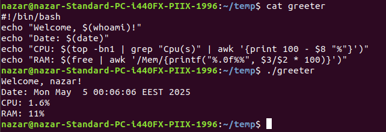
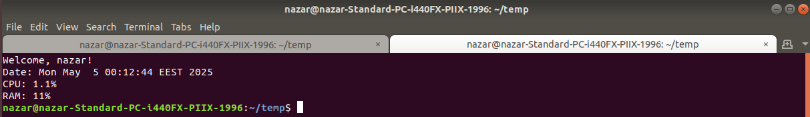
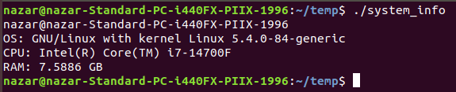

# Лабораторна робота №7

**Тема:** Створення скриптових сценаріїв та визначення апаратної конфігурації системи

**Мета роботи:**

1. Отримання практичних навиків роботи з командною оболонкою Bash.
2. Знайомство знайомство з базовими діями при роботі зі скриптовими сценаріями.

**Матеріальне забезпечення занять:**

1. ЕОМ типу IBM PC;
2. ОС сімейства Windows та віртуальна машина Virtual Box (Oracle);
3. ОС GNU/Linux (будь-який дистрибутив);
4. Сайт мережевої академії Cisco netacad.com та його онлайн курси по Linux.

**Виконували:**

- Машовець Аліна
- Шурубор Назар

## Завдання для попередньої підготовки

1. \*Прочитайте короткі теоретичні відомості до лабораторної роботи та зробіть невеликий словник базових англійських термінів з питань призначення команд та їх параметрів.

    | Term| Meaning |
    |-----|---------|
    | `#!` (shebang) | When used in the first line of an executable file, specifies the path the interpreter (or shell) |
    | `/bin/bash` | Absolute path of the Bash shell |
    | arguments | Information passed to a program |
    | `echo` | Command that displays output in the terminal |
    | `exit status` | Value returned by a program that can indicate the success or failure of a command |
    | for loops | Component of programming languages which allow code to executed repeatedly |
    | variables | Component of programming languages used to store information |
    | `/dev/sd*` | SCSI (Small Computer System Interface) hard drive device files |
    | drivers | Software that allows hardware devices to communicate with the installed operating system |
    | hard drives | An electromechanical or electronic storage device that holds data to be accessed by the system |
    | motherboards | The main hardware board in the computer through which the central processing unit (CPU), random-access memory (RAM) and other components are all connected |
    | optical drives | Removable storage media. Includes CD-ROM, DVD, and Blu-Ray |
    | partitions | A logical division of a hard drive, designed to take a large amount of available storage space and break it up into smaller areas |
    | peripherals | A device connected to the system via bus that provides additional functionality |
    | power supplies | Devices that provide power to the computer by converting alternating current into direct current, which the computer uses at various voltages |
    | processors | The brain of the computer, where the execution of code takes place and where most calculations are done. It is directly connected (soldered) to the motherboard, as motherboards are typically configured to work with specific types of processors |
    | solid state disks | A type of hard disk that has no moving parts or spinning disks, just memory locations to be read by the controller |

2. Вивчіть матеріали онлайн-курсу академії Cisco “NDG Linux Essentials”:
    - Chapter 11 - Basic Scripting
    - Chapter 12 - Understanding Computer Hardware

3. Пройдіть тестування у курсі NDG Linux Essentials за такими темами:
    - Chapter 11 Exam
    - Chapter 12 Exam

4. На базі розглянутого матеріалу дайте відповіді на наступні питання:
    1. \*Охарактеризуйте поняття скриптового сценарію у командній оболонці.
    2. \*Яким чином створюються та редагуються скрипти, що треба зробити щоб запустити скрипт?

        Scripts are created and written in text editors. It could be any text editor, be it one with a GUI
        like VSCode, or a terminal one like `nano` or `vim`.

        To run the script we first need to allow running it with the command `chmod +x script.sh`
        and after that the script is now allowed to execute and we can run it with `./script.sh`.

    3. \*\*Які основні компоненти материнської плати ви знаєте?
    4. \*\*Коротко охарактеризуйте для яких пристроїв оперують поняттями MBR та GPT?
    5. \*\*В чому суть операції монтування, для чого вона потрібна?

        Mounting attaches the file system of the drive (like a USB drive, or an HDD/SSD) to the file system
        of the operating system, which makes the drive accessible.

        To mount the drive `/dev/sdb1` to the directory `/mnt/usb` the following command is used:

        ```sh
        mount /dev/sdb1 /mnt/usb
        ```

        And to unmount that drive the opposite command is used:

        ```sh
        umount /dev/sdb1
        ```

5. Підготувати в електронному вигляді початковий варіант звіту:
    - Титульний аркуш, тема та мета роботи
    - Словник термінів
    - Відповіді на п.4.1 та п.4.5 з завдань для попередньої підготовки

## Хід роботи

1. Початкова робота в CLI-режимі в Linux ОС сімейства Linux:
    - Запустіть операційну систему Linux Ubuntu. Виконайте вхід в систему та запустіть термінал (якщо виконуєте ЛР у 401 ауд.).
    - Запустіть віртуальну машину Ubuntu_PC (якщо виконуєте завдання ЛР через академію netacad)
    - Запустіть свою операційну систему сімейства Linux (якщо працюєте на власному ПК та її встановили) та запустіть термінал.

2. Опрацюйте всі приклади команд, що представлені у лабораторних роботах курсу NDG Linux Essentials - Lab 11: Basic Scripting та Lab 12: Understanding Computer Hardware. Створіть таблицю для опису цих команд

    | Назва команди | Її призначення та функціональність                     |
    | ------------- | ------------------------------------------------------ |
    | `echo`        | Command that displays output in the terminal.          |
    | `date`        | Displays date and time.                                |
    | `read`        | Requests user input.                                   |
    | `grep`        | Command to search for matching patterns in a file.     |
    | `exit`        | Exits the current shell or script.                     |
    | `arch`        | Displays CPU's architecture.                           |
    | `lscpu`       | Displays information about the CPU.                    |
    | `free`        | Displays information about total, used, free RAM, etc. |
    | `lspci`       | Displays all devices connected with the PCI bus.       |
    | `lsusb`       | Displays all devices connected with the USB bus.       |
    | `fdisk`       | Displays information and modifies MBR disks.           |
    | `gdisk`       | Displays information and modifies GPT disks.           |

    > **Примітка:** Скріншоти виконання команд в терміналі можна не представляти, достатньо коротко описати команди в таблиці.

3. Створіть скриптові сценарії з виводом текстових повідомлень для користувача (продемонструйте скріншоти):

    - сценарій має виводити привітання до поточного користувача вказуючи поточну дату та інформацію про поточну систему;

        To make this "greeter" we've made a bash script. Here's how it looks like:

        ```bash
        #!/bin/bash
        echo "Welcome, $(whoami)!"
        echo "Date: $(date)"
        echo "CPU: $(top -bn1 | grep "Cpu(s)" | awk '{print 100 - $8 "%"}')"
        echo "RAM: $(free | awk '/Mem/{printf("%.0f%%", $3/$2 * 100)}')"
        ```

        This command outputs the the name of the user, current date and time and CPU & RAM usage.
        To display the username the `whoami` command is used. For the date - the `date` command.
        CPU and RAM usage weren't that easy. We've found a code snippet on the internet to display
        the percentages. They use `top` and `free` commands, however to filter and format the output
        values the `grep` and `awk` commands were also used.

        The resulting output will look something like this:

        

        > Also we can make this greeting message appear every time we open the terminal by putting it
        > into the `.bashrc` (or `.zshrc`) file using the following command:
        >
        > ```bash
        > echo "./greeter" >> ~/.bashrc
        > ```
        >
        > And this will be the result:
        > 

    - \*сценарій має виводити інформацію про апаратну конфігурацію поточної системи (використовуйте команди розглянуті в Lab 12: Understanding Computer Hardware);

        For this task we've wrote the following script:

        ```bash
        #!/bin/bash
        echo "$(whoami)@$(hostname)"
        echo "OS: $(uname -o) with kernel $(uname -s) $(uname -r)"
        echo "CPU: $(lscpu | grep 'Model name' | cut -f 2 -d ":" | awk '{$1=$1}1')"
        echo "RAM: $(grep MemTotal /proc/meminfo | awk '{print $2}' | xargs -I {} echo "scale=4; {}/1024^2" | bc) GB"
        ```

        First it outputs current user and hostname of the computer using the `whoami` and `hostname` commands.
        Next it outputs the name of the OS that is in use and its kernel version using a bunch of `uname`
        commands with different arguments. To show the CPU we've used the output from the `lscpu` command,
        however to extract the actual model name of it we've used a code snippet on a forum online.
        To show the total RAM also a command from the internet was used.

        The resulting output of the script looks like this in a VM:

        

    - \*\*наведіть свій приклад скриптового сценарію.

        My personal example is I almost always when setting up a local Minecraft server make a bash script
        to start the server, since it sometimes contains lots of arguments in the start command.

        Here's one:

        ```sh
        #!/usr/bin/env sh

        server_jar=paper-1.21-38.jar 
        mem=8192M

        java -Xms$mem -Xmx$mem -XX:+AlwaysPreTouch -XX:+DisableExplicitGC -XX:+ParallelRefProcEnabled -XX:+PerfDisableSharedMem -XX:+UnlockExperimentalVMOptions -XX:+UseG1GC -XX:G1HeapRegionSize=8M -XX:G1HeapWastePercent=5 -XX:G1MaxNewSizePercent=40 -XX:G1MixedGCCountTarget=4 -XX:G1MixedGCLiveThresholdPercent=90 -XX:G1NewSizePercent=30 -XX:G1RSetUpdatingPauseTimePercent=5 -XX:G1ReservePercent=20 -XX:InitiatingHeapOccupancyPercent=15 -XX:MaxGCPauseMillis=200 -XX:MaxTenuringThreshold=1 -XX:SurvivorRatio=32 -Dusing.aikars.flags=https://mcflags.emc.gs -Daikars.new.flags=true -jar $server_jar nogui
        ```

        The script has two easily editable variables: one for the name of the executable file of the server and
        one for the memory allocated to the server. And all of that is make to run one `java -jar` command with
        just way too many arguments.

## Контрольні запитання

1. В чому відмінність між командами `arch` та `lscpu`?

    Команда `arch` виводить лише тип архітектури процесора, наприклад, `x86_64`, а ось команда `lscpu` надає
    детальну інформацію про ЦП: архітектуру, кількість ядер, потоків, модель, підтримувані інструкції тощо.
    Це розширена команда для системного аналізу.

2. Якою командою можна отримати інформацію про стан використання RAM поточною системою?

    Командою `free`. Також цю інформацію може показувати `htop` (або аналогічні йому).

3. \*Яким чином у скриптах можна опрацьовувати змінні та створювати розгалужені та циклічні сценарії?

    Створення змінної та вивід її:

    ```bash
    username="persona"
    echo Welcome, $username!
    ```

    Приклад розгалуження за допомогою `if`:

    ```bash
    if [ "$x" -gt 5 ]; then
        echo "x is greater than 5"
    fi
    ```

    Приклад циклу `for` (вивести кожен `.txt` файл в робочому каталозі):

    ```bash
    for file in *.txt; do
        echo "$file"
    done
    ```

4. \*Які команди для перегляду стану підключення периферійних пристроїв можна використати в терміналі?

    - `lsusb`: показує підключені пристрої шиною USB;
    - `lspci`: показує підключені пристрої шиною PCI;
    - `lsblk`: показує блочні пристрої (жорсткі диски, флешки).

5. \*\*Які можливості застунку gparted?

    GParted — це графічний інструмент для керування розділами диска. Його основні можливості:
    - Створення, видалення, переміщення, копіювання та зміна розміру розділів;
    - Форматування у файлові системи: ext4, NTFS, FAT32, btrfs та інші;
    - Зміна прапорців розділів (наприклад, `boot`, `swap` тощо).

## Висновки

Ми отримали практичні навички роботи з командною оболонкою Bash та ознайомились з базовими діями при
роботі зі скриптовими сценаріями.
