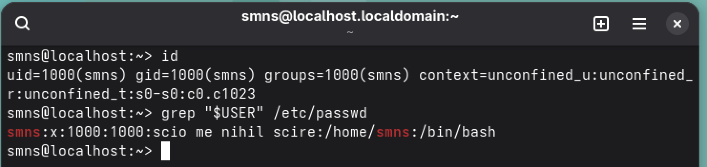
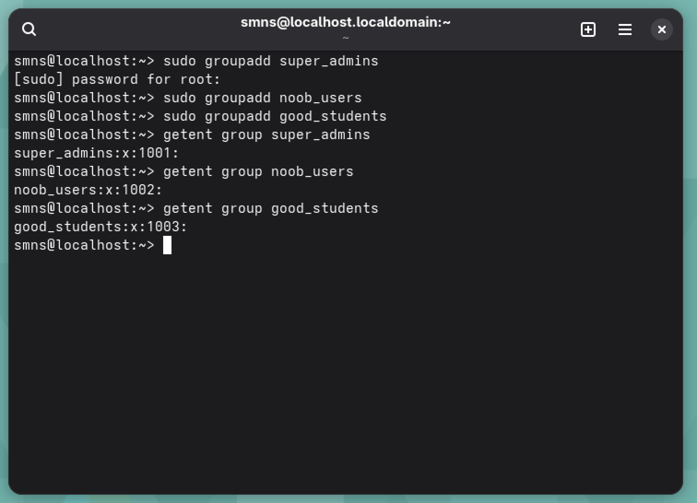
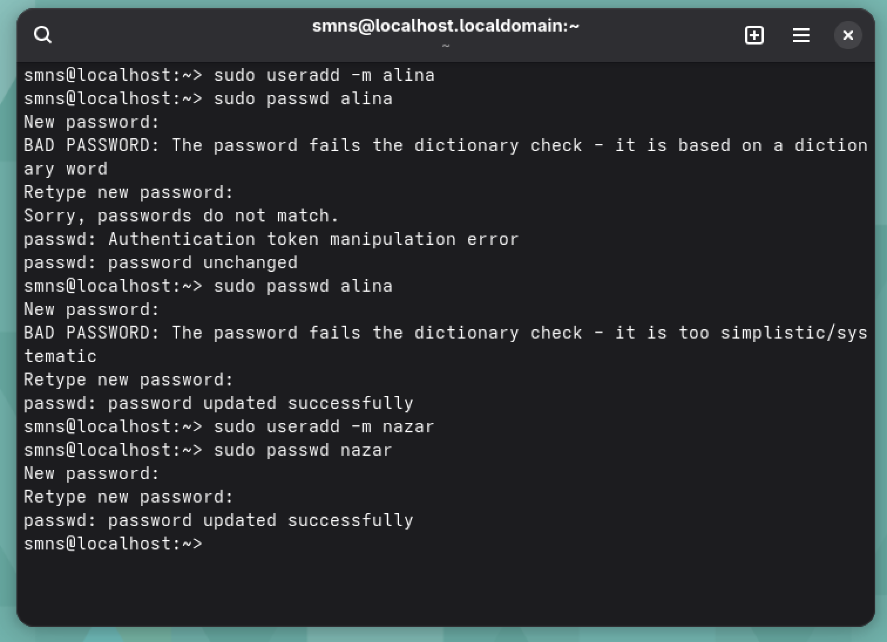
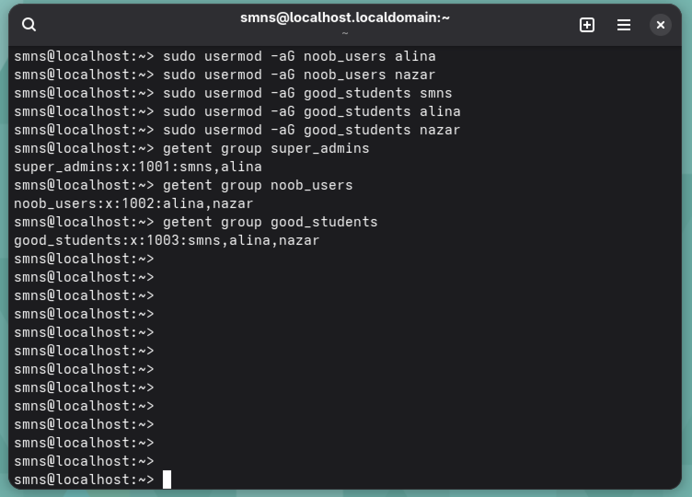
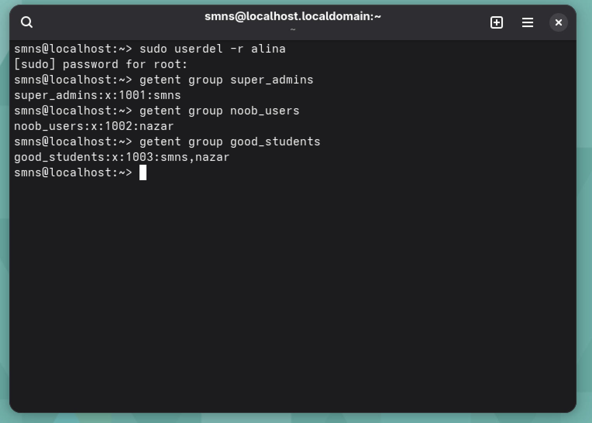
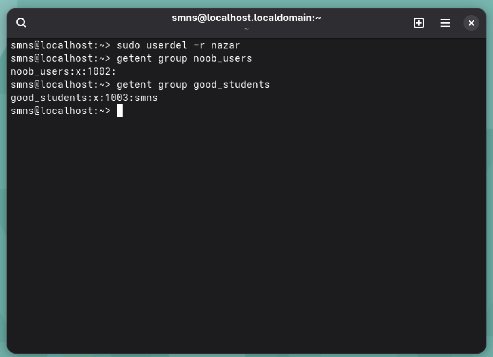
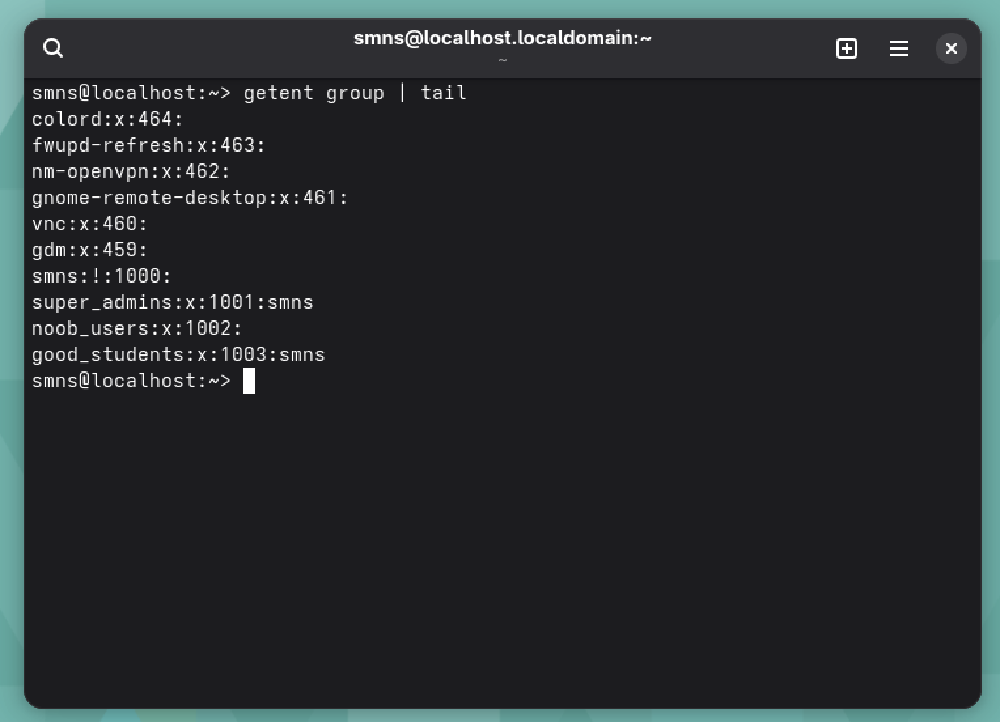
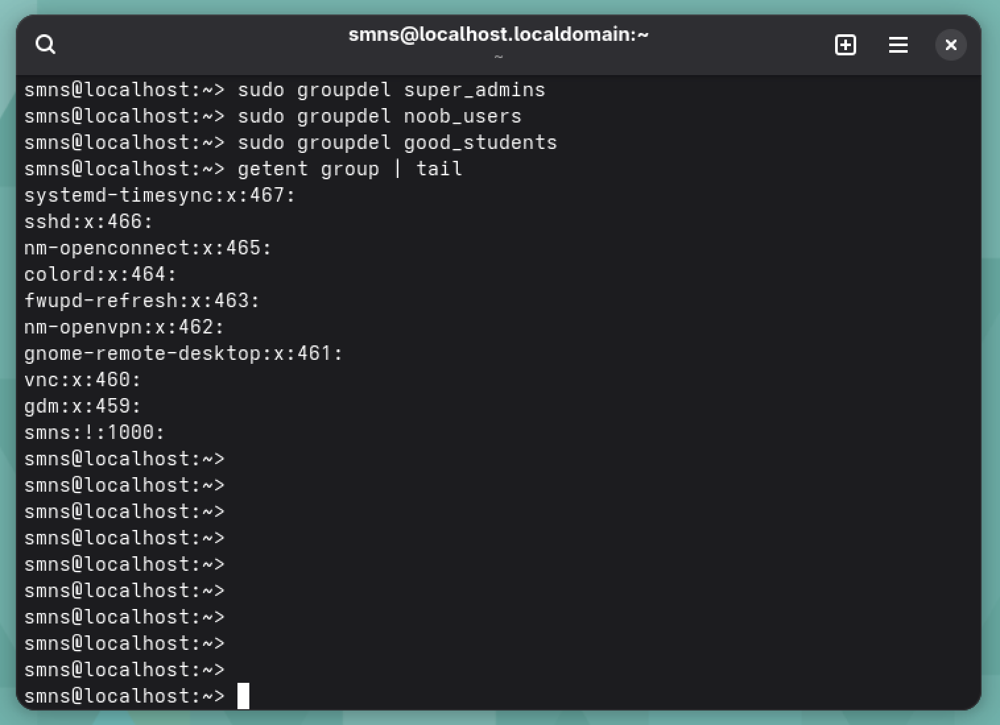

# Лабораторна робота №9

**Тема:** Захист системи та користувачів у Linux. Створення користувачів та груп

**Мета роботи:**

1. Отримання практичних навиків роботи з командною оболонкою Bash.
2. Знайомство з базовими діями при створенні нових користувачів та нових груп користувачів.

**Матеріальне забезпечення занять:**

1. ЕОМ типу IBM PC;
2. ОС сімейства Windows та віртуальна машина Virtual Box (Oracle);
3. ОС GNU/Linux (будь-який дистрибутив);
4. Сайт мережевої академії Cisco netacad.com та його онлайн курси по Linux.

**Виконували:**

- Машовець Аліна
- Шурубор Назар

## Завдання для попередньої підготовки

1. \*Прочитайте короткі теоретичні відомості до лабораторної роботи та зробіть невеликий словник базових англійських термінів з питань призначення команд та їх параметрів.
2. Вивчіть матеріали онлайн-курсу академії Cisco "NDG Linux Essentials":
    - Chapter 15 - System and User Security;
    - Chapter 16 - Creating Users and Groups.
3. Пройдіть тестування у курсі NDG Linux Essentials за такими темами:
    - Chapter 15 Exam;
    - Chapter 16 Exam.
4. На базі розглянутого матеріалу дайте відповіді на наступні питання:
    - Розкрийте поняття UPG, коли їх доцільно використовувати?

        In some Linux distributions, particularly those based upon Red Hat, when a user ID (UID) is created, a user private group (UPG) is also created with that user as its only member. In these distributions, the UID and the ID of the UPG are supposed to match.

        There are some risks introduced when using large catch-all groups like users accidentally giving access to private files with others.
        Instead each user has a default group of their own, which fixes that exact issue and more.

    - \*Якими командами можна створити групи користувачів? Наведіть приклади.

        Using the `groupadd` command. For example the following command will just create a group `qemu_users`:

        ```sh
        sudo groupadd qemu_users
        ```

        Or we could also give it a custom GID:

        ```sh
        sudo groupadd -g 1050 qemu_users
        ```

    - \*\*Якими командами можна змінити налаштування груп користувачів? Наведіть приклади.

        Adding user to a group:

        ```sh
        sudo usermod -aG qemu_users alina
        ```

        Changing the name of the group:

        ```sh
        sudo groupmod -n qemu_guests qemu_users
        ```

        Changing the GID:

        ```sh
        sudo groupmod -g 2001 qemu_guests
        ```

5. Підготувати в електронному вигляді початковий варіант звіту:
    - Титульний аркуш, тема та мета роботи;
    - Словник термінів;
    - Відповіді на п.4.1 та п.4.5 з завдань для попередньої підготовки.

## Хід роботи

1. Початкова робота в CLI-режимі в Linux ОС сімейства Linux:
    - Запустіть операційну систему Linux Ubuntu. Виконайте вхід в систему та запустіть термінал (якщо виконуєте ЛР у 401 ауд.);
    - Запустіть віртуальну машину Ubuntu_PC (якщо виконуєте завдання ЛР через академію netacad);
    - Запустіть свою операційну систему сімейства Linux (якщо працюєте на власному ПК та її встановили) та запустіть термінал.

2. Опрацюйте всі приклади команд, що представлені у лабораторних роботах курсу NDG Linux Essentials - Lab 15: System and User Security та Lab 16: Creating Users and Groups. Створіть таблицю для опису цих команд.

    | Назва команди | Її призначення та функціональність                           |
    | ------------- | ------------------------------------------------------------ |
    | `su`          | Switches to another user account (default: root).            |
    | `sudo`        | Executes a command with superuser privileges.                |
    | `getent`      | Fetches entries from system databases (e.g., users, groups). |
    | `id`          | Shows the current user's UID, GID, and groups.               |
    | `who`         | Lists users currently logged into the system.                |
    | `w`           | Shows who is logged in and what they are doing.              |
    | `last`        | Displays login history of users.                             |
    | `groupadd`    | Creates a new user group.                                    |
    | `groupmod`    | Modifies an existing group.                                  |
    | `groupdel`    | Deletes an existing group.                                   |
    | `useradd`     | Creates a new user account.                                  |
    | `passwd`      | Sets or changes a user's password.                           |
    | `chage`       | Manages user password expiration settings.                   |
    | `usermod`     | Modifies an existing user account.                           |
    | `userdel`     | Deletes a user account.                                      |

    > **Примітка:** Скріншоти виконання команд в терміналі можна не представляти, достатньо коротко описати команди в таблиці.

3. Виконайте наступні практичні завдання у терміналі наступні дії (продемонструвати скріншоти):
    - виведіть інформацію про поточного користувача різними способами (підказка використовуйте команди `id` та `grep`);

        To get the information about the current user we can use either for these commands:

        ```sh
        id
        grep "$USER" /etc/passwd
        ```

        Here's an example output:

        

    - \*попрактикуйте в терміналі команди `last`, `w` та `who`. Порівняйте результати виводу кожної команди, які деталі відсутні в кожній із команд порівняно з іншими?

        

        The screenshot shows the output of the `w`, `who`, and `last` commands in the terminal. The `w` command provides detailed real-time information about logged-in users, including their terminal, login time, idle time, CPU usage, and what command they are currently running, along with system load and uptime. The `who` command gives a simpler view, showing just the currently logged-in users, their terminals, and login times, but without details like idle time or running processes. In contrast, the `last` command displays a history of user logins, logouts, system reboots, and crashes, but does not show any real-time user activity. Each command offers a different level of detail, with some overlapping information and some unique.

    - \*створіть три нові групи користувачів - `super_admins`, `noob_users` та `good_students`, визначте їх ідентифікатори;

        To create the groups we will use the `groupadd` command ran with `sudo`:

        ```sh
        sudo groupadd super_admins
        sudo groupadd noob_users
        sudo groupadd good_students
        ```

        And to check the GIDs of the groups we created we will use the `getent` command.

        Here's what output we've got:

        

    - \*для кожного члену Вашої команди за допомогою терміналу створіть нового користувача (якщо працюєте самі, то просто трьох довільних користувачів), не забудьте після створення нового користувача одразу задати йому пароль;

        To create users we will use the `useradd` command in pair with the `passwd` command to set the password:

        ```sh
        sudo useradd -m alina
        sudo passwd alina

        sudo useradd -m nazar
        sudo passwd nazar
        ```

        

    - \*\*додайте нових користувачів у створені Вами нові групи таким чином, щоб у групах `super_admins` та `noob_users` було по 2 користувачі, один з яких є в обох групах, у групу `good_students` додайте всіх трьох користувачів;

        To add the created users to group we will use the `usermod` command with the `-a` and `-G` arguments. `-a` mark the command as adding and `-G` provides the list of groups to add to.

        ```sh
        sudo usermod -aG super_admins smns
        sudo usermod -aG super_admins alina

        sudo usermod -aG noob_users alina
        sudo usermod -aG noob_users nazar

        sudo usermod -aG good_students smns
        sudo usermod -aG good_students alina
        sudo usermod -aG good_students nazar
        ```

    - \*\*перегляньте інформацію про групи, та які користувачі до них входять, поясніть що ви бачите;

        After adding the users to group we can view the members of the groups with `getent group`:

        

    - \*\*видаліть першого створеного вами користувача, перегляньте чи залишиться інформація про нього в групах, де він перебував;

        Let's delete the user `alina` with the `userdel` command with the `-r` argument to remove the user's home directory:

        ```sh
        sudo userdel -r alina
        ```

        And check all groups and see if the user disappeared:

        

        As we can see the user disappeared from all the groups.

    - \*\*видаліть другого користувача, перегляньте чи залишиться інформація про нього в групах, де він перебував;

        Let's repeat the same steps with the other user - `nazar`:

        

        We can see the same result.

    - \*\*перегляньте інформацію про існуючі групи користувачів;

        Let's check the groups that exist with the `getent group` command:

        

    - \*\*видаліть створені Вами групи користувачів;

        To delete the groups we will use the `groupdel` command:

        ```sh
        sudo groupdel super_admins
        sudo groupdel noob_users
        sudo groupdel good_students
        ```

    - \*\*перегляньте інформацію про існуючі групи користувачів.

        And now let's check the list of groups again:

        

        We can no longer see the groups we've just deleted here.

## Відповіді на контрольні запитання

1. Чому в конфігураційних файлах паролі не зберігається в явному вигляді?

    Passwords should never ever be stored as plain-text in systems. In Linux, like in most other places only hashes of passwords are stored. Hashes are irreversible forms of passwords, so when typing in a password the OS only compares hashes of the both.

2. Чому не рекомендується виконувати повсякденні операції, використовуючи обліковий запис `root`?

    It’s risky to use the `root` account for regular work because even small errors can break the system or open it to security threats. It’s safer to use a regular user account and switch to `root` only when necessary using `sudo`.

3. \*У чому відмінність механізмів отримання особливих привілеїв `su` і `sudo`?

    `su` switches to another user (usually `root`) by starting a new shell, but `sudo` runs a single command with elevated privileges, using current user’s credentials.

4. \*Чому домашній каталог користувача `root` не розміщено в каталозі `/home`?

    `root`'s home is `/root` to separate it from regular users and ensure access even if `/home` is unavailable.

5. \*Для чого використовується команда `getent`?

    `getent` retrieves entries from system databases like `passwd`, `group`, `hosts`, etc.

6. \*Як можна змінити пароль користувача?

    Using the `passwd` command. For example:

    ```sh
    sudo passwd smns
    ```

7. \*\*Яким чином можна видалити існуючі групи користувачів? Чи залишиться інформація про них десь у системі?

    To delete a user group, the `groupdel` command is used. This removes the group entry from `/etc/group`. However, if files on the system still have that group’s GID, the group name will appear as the numeric GID.

8. \*\*Яке призначення команди `chage`?

    The `chage` command is used to manage password expiration and account aging settings. It allows administrators to set the maximum number of days a password is valid, minimum days between changes, and the date of last password change. This helps enforce password policies for better security.

9. \*\*Які параметри команди `usermod` ви вважаєте найбільш використовуваними?

    Commonly used usermod parameters include `-aG` to append a user to supplementary groups, `-d` to change the user’s home directory, and `-s` to change their login shell. `-L` and `-U` are also used frequently to lock or unlock user accounts.

## Висновки

Ми отримали практичні навики роботи з командною оболонкою Bash, ознайомились з базовими діями при створенні нових користувачів та нових груп користувачів.
