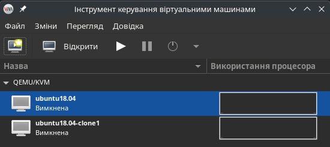

# Work-case №3

**Виконували:**

- Машовець Аліна
- Шурубор Назар

## Завдання

1. В робочому середовищі віртуальної машини Virtual Box, VMWare Workstation (або інший на Ваш вибір) необхідно виконати:
    - Клонування вашої віртуальної робочої ОС (Work-case 2). Яким чином це можна зробити? Продемонструйте всі етапи;
    - Може виникнути необхідність перенесення (клонування) ОС у інше віртуальне середовище. Які треба виконати дії для експорту вашої віртуальної робочої ОС?

    We are using QEMU/KVM as a hypervisor with `virt-manager` as the GUI. It is very simple to clone a VM using such tools.

    1. Right-click the VM and select "Clone"

        

    2. Select cloning options. For us the defaults are good.

        

    3. Done! The cloned VM will now show up in the list of VMs.

        

2. В ході роботи одна робоча віртуальна машина може взаємодіяти з іншою. Для цього необхідно між ними розгорнути мережу. Опишіть які типи організації мережевих з'єднань підтримуються в середовищі віртуальних машин, в чому особливість кожного з них:
    - Трансляція мережевих адрес (NAT);

        Network Address Translation (NAT) is the process of converting one or more private IP addresses to one or more public IP addresses, or vice versa, to provide internet access to local hosts.
        Additionally, NAT performs port number translation, meaning it replaces the host's port number with another port number in the packet sent to the destination. By doing so, NAT maintains a pool of public IP addresses and hides your network's addressing scheme. NAT then makes the appropriate IP address and port number entries in the NAT table.

        This can be represented schematically as follows:
        

    - Мережевий міст (Bridged);

        Bridged Networking allows a virtual machine to connect to the physical network of the host computer as if it were a separate, independent physical device on that network. The VM receives its own IP address directly from the physical network's DHCP server (or a static IP if configured) and appears to other devices on the network as a full participant. This means VMs can directly interact with other devices in the host's local area network (LAN) and the internet, without going through the host's NAT. This mode is ideal for scenarios where VMs need to be fully accessible from the external network, such as hosting servers or services.

    - Віртуальний адаптер хоста (Host-only);

        Host-only Networking creates a completely isolated private network between the host computer and its virtual machines. In this mode, VMs can communicate with each other and with the host machine, but they do not have access to external networks (like the internet) or other physical networks the host is connected to. The host machine typically acts as a DHCP server for this virtual network, assigning IP addresses to the VMs. This connection type is perfect for setting up isolated test environments or groups of VMs that need to interact strictly among themselves and with the host, without any external exposure.

    - Внутрішня мережа (Internal Network).

        Internal Network creates an isolated virtual network that is completely segregated from both the host computer and the outside world. Virtual machines configured to operate within an internal network can only communicate with other VMs that are also part of the same internal network. The host computer has no access to this network, and the VMs cannot reach the internet or any other physical networks outside of it. This mode is highly useful for building completely isolated lab environments or simulating complex network topologies without any risk of affecting or being affected by external networks.

3. Розгорніть мережу між вашою робочою ОС та її клоном (завдання 1):
    - Продемонструйте базові команди для налаштування мережевих параметрів ОС, поясніть, що вони виконують.
    - Обидві ОС мають мати вихід у мережу Інтернет. Відкрийте браузер та перегляньте будь-яке відео в youtube

        

    - Налаштуйте та продемонструйте обмін повідомленнями між двома ОС по локальній мережі. Які команди в терміналі при цьому необхідно ввести?

        We can figure out local IPs of machines with `ifconfig` or `ip addr`. Here we can see that the original
        VM's local address is `192.168.2.112`:

        

        The same way we find that the cloned VM's address is `192.168.2.113`.

        > Also `virt-manager` actually just shows the given IP address of the VM on its NIC configuration page:
        > 

        To check if the VMs can "talk" to each other we can try pinging one VM from the other with the `ping` command:

        

    - Налаштуйте спільну мережеву папку для обох ОС. Спробуйте скопіювати файли з цієї директорії в домашній каталог користувача (віртуальна робоча ОС) та на робочій стіл (клон віртуальної робочої ОС).

        To set up a shared in `virt-manager` we need to perform the following steps:

        1. Enable shared memory

            

        2. Add the "Filesystem" hardware

            

            > **Note:** Because of us using a very old version of Ubuntu we had to switch drivers to deprecated `virtio-9p`.

        3. Mount the drive

            ```sh
            sudo mount -t 9p -o trans=virtio mount_virtfs_pool /mnt/virtfs-pool/
            ```

        4. And it works!

            

4. Яким чином можна організувати обмін інформацією між вашою основною ОС (наприклад Windows) та віртуальними ОС? Скопіюйте довільний аудіо-файл з вашої основної ОС на робочий стіл віртуальної ОС та її клона. Як зробити зворотну дію, коли треба документ з робочого столу віртуальної ОС скопіювати до вашої основної робочої ОС?

    To set up information exchanging between the host and the guest OS we need something usually called "guest tools".
    Basically any hypervisor has their "guest tools". For QEMU running a Ubuntu Linux guest we need to install (on
    the guest) these tools (called a "guest agent") using the `apt` package manager:

    ```sh
    sudo apt update
    sudo apt install qemu-quest-agent
    ```

    After that we also need to start the service and we're basically good to go:

    ```sh
    sudo systemctl enable qemu-guest-agent
    sudo systemctl start qemu-guest-agent
    ```

    Now we have a shared clipboard between the guest and host, drag-and-drop functionality (with limitations), automatic
    screen resolution changing to fit the VM window and other stuff.

    However, with the QEMU guest agent drag-and-drop works only host-to-guest and not guest-to-host, which is
    quite disappointing, so to copy files from guest-to-host we'd need to use a shared folder, that we luckily
    set up in the previous task.

    > **Примітка:** Якщо якісь завдання не вийшло зробити, то хоча б опишіть методику їх виконання.
