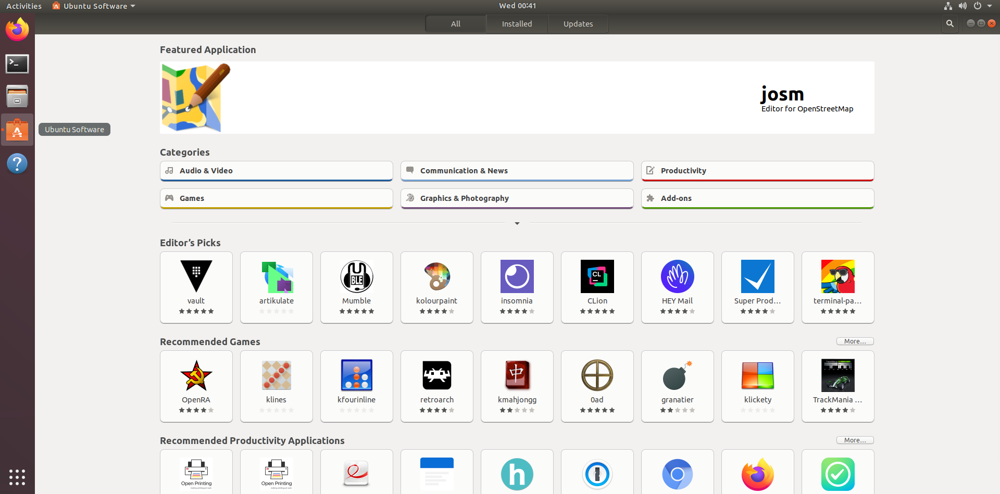

# Work-case №4

**Виконували:**

- Машовець Аліна
- Шурубор Назар

## Завдання

1. В ході роботи досить часто виникає необхідність встановлювати нові програми та додатки. Для цього необхідно в терміналі вміти працювати з менеджерами пакетів:
    - Дайте розгорнуте визначення таким поняттям як "пакет" та "репозиторій".

        In Linux, a **package** is a compressed archive containing all the necessary files for a piece of software, including the compiled program or library, its dependencies, metadata, and installation scripts. These packages simplify software distribution and management, ensuring that all required components are available and correctly placed on the system. When you install software in Linux, you're typically installing a package.

        A **repository** in Linux is a centralized storage location where software packages are kept and maintained. It acts as a trusted source from which your system's package manager can download, install, and update software. Repositories ensure that you receive stable, tested, and secure versions of applications and system components, streamlining the process of keeping your Linux system up-to-date.

    - Надайте короткий огляд існуючих менеджерів пакетів у Linux. Охарактеризуйте їх основні можливості.

        Linux distributions use various package managers to simplify software installation, updates, and removal. These tools automate complex dependency resolution, ensuring all necessary components are correctly installed. They also manage software versions, facilitate system-wide updates, and integrate with a network of official and community-maintained repositories to provide a vast selection of applications.

        APT (Advanced Package Tool), for example, is widely used by Debian, Ubuntu, and their derivatives to manage .deb packages. APT is renowned for its robust dependency resolution and stable command-line interface. It provides powerful features for searching, installing, upgrading, and removing software packages from repositories. In contrast, DNF (Dandified Yum), the successor to YUM, is the default package manager for Fedora, Red Hat Enterprise Linux, and CentOS, and it handles .rpm packages. DNF stands out with its improved performance, more efficient dependency resolution using a SAT solver, and support for modular repositories, which allow users to manage different versions of software components.

        Another prominent package manager is Zypper, which is primarily used in openSUSE and SUSE Linux Enterprise. Zypper is a powerful command-line tool that manages .rpm packages and offers comprehensive features for repository management, sophisticated update handling, and effective package information querying. Lastly, Pacman, used by Arch Linux and its derivatives, is known for its speed and efficiency in managing .pkg.tar.xz packages. Pacman has a minimalist design and provides robust dependency tracking and seamless system upgrades.

2. Визначте який менеджер пакетів використовує ваш дистрибутив Linux. Опишіть основні команди для роботи з ним:

    - Пошук, скачування та установка необхідних пакетів, яких у Вашій системі немає (зі сховища по замовчуванню, з нового репозиторію тощо).

        On our Ubuntu VM we have the `apt` package manager. Here are the most commonly used commands:

        - `apt update`: download information about available packages;
        - `apt install [package]`: installing/upgrading a package (one or several);
        - `apt upgrade`: install all available updates;
        - `apt remove [package]`: uninstall a package (one or several);
        - `apt search [term]`: search for packages;
        - `add-apt-repository [options] repository`: adding the repository to the `sources.list` file and importing the repo's GPG key.

    - Перегляд інформації про встановлені та доступні пакети.

        To view available packages the following command is used:

        ```sh
        apt list
        ```

        And to view only installed packages we can add the `--installed` option:

        ```sh
        apt list --installed
        ```

    - Видалення непотрібних або застарілих пакетів.

        With `apt` this is super easy and is just this:

        ```sh
        apt autoremove
        ```

    - Оновлення менеджера пакетів.

        First we update the list of available packages:

        ```sh
        apt update
        ```

        and then (if we want to do that of course) we install the latest versions of all the installed packages:

        ```sh
        apt upgrade
        ```

3. Встановіть у терміналі через менеджер пакетів на свою систему:
    - Новий відео- чи аудіоплейер.

        As an example we will install the VLC media player.

        As a prerequisite we should update the package index:

        ```sh
        apt update
        ```

        First, we are not sure about what the package name is for VLC, so let's search for it:

        ```sh
        apt search vlc | less
        ```

        

        Ah, it's conveniently called `vlc`. Let's now install it with:

        ```sh
        apt install vlc
        ```

        

    - Середовище для мови програмування, що ви вивчаєте.

        Same thing, but different package. Let's install Neovim!

        ```sh
        apt install neovim
        ```

        While trying to install it we find out that we already have it installed on our VM:

        

        And now `nvim` is available in the terminal:

        

4. Яким чином можна встановити нові програми через магазини додатків та менеджери пакетів у графічному середовищі. Наведіть свої приклади.

    Most Linux distributions ship with a GUI software installation application, especially on more
    user-friendly distros like Ubuntu. Though, most of these do not install traditional packages,
    but rather `flatpak` or `snap` packages, which are installed in user's environment and do not
    require root access to install or modify. One big downside to these packages is sometimes they
    can access less of PC's hardware because of the way flatpak and snap packages are engineered.

    Examples of these stores would be:

    - **Ubuntu Software** for Ubuntu:

        

    - **Discover** for Arch Linux:

        
