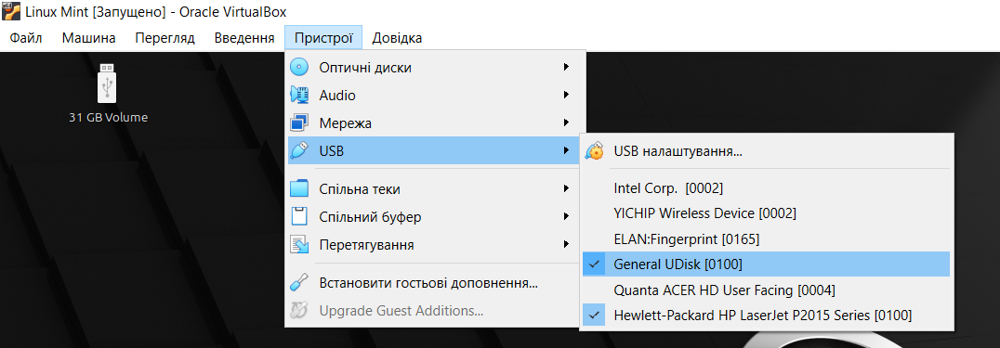
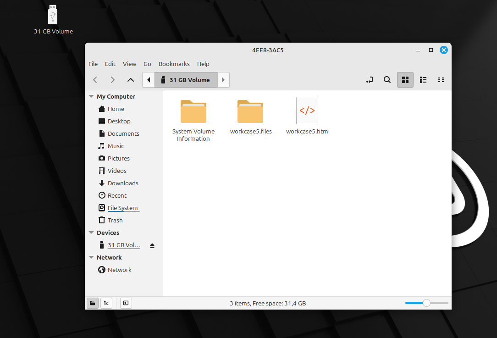
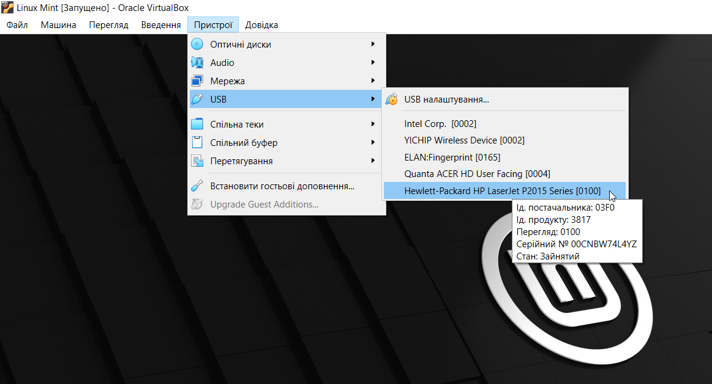
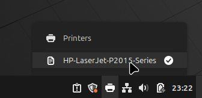
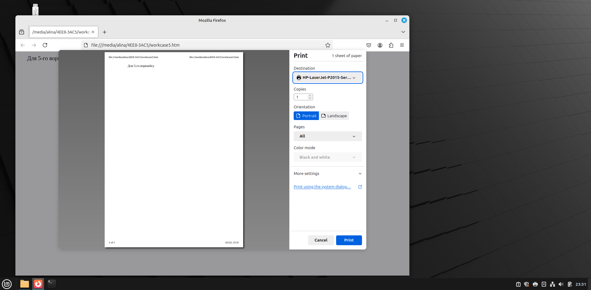
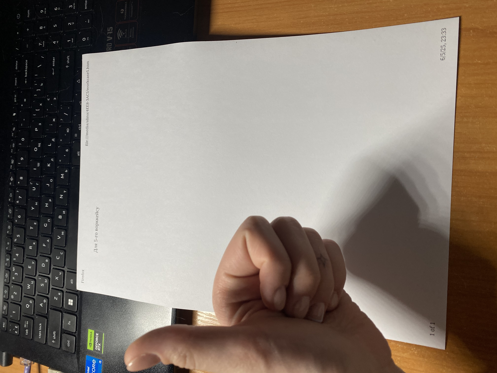
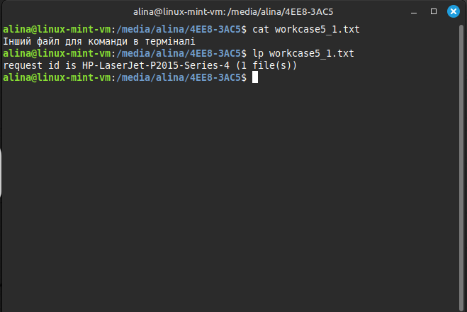
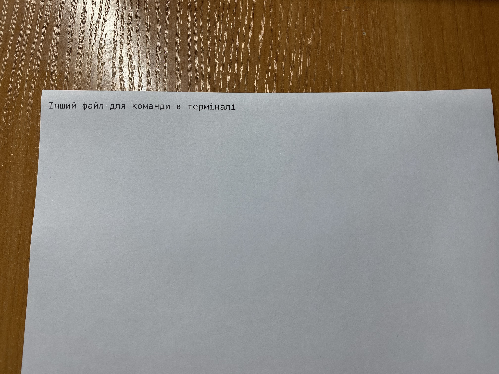
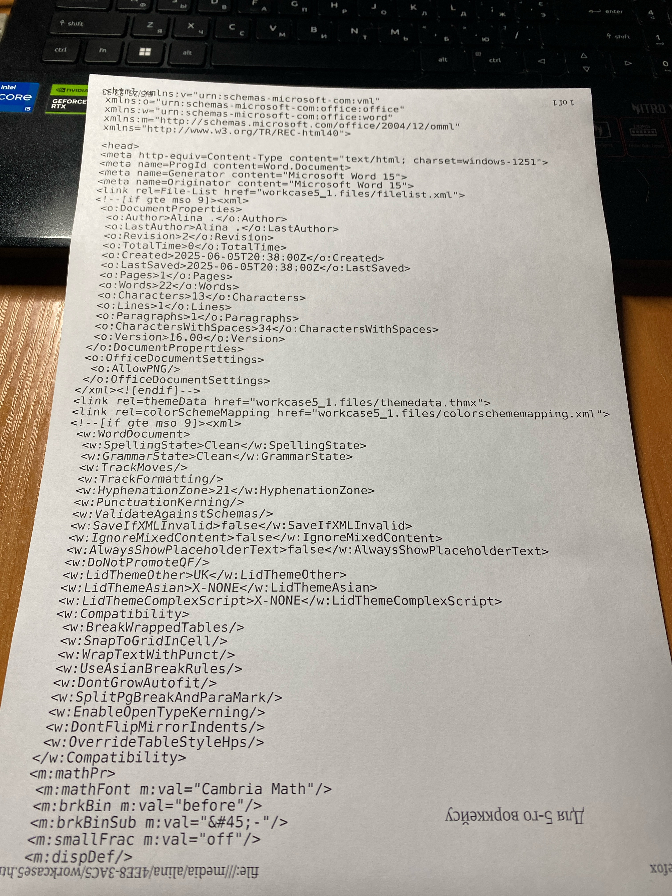

# Work-case №5

**Виконували:**

- Машовець Аліна
- Шурубор Назар

## Завдання

1. При роботі з персональним комп’ютером дуже часто виникає необхідність підключати периферійне обладнання. На прикладі принтера та флешки опишіть який механізм має ОС Linux для роботи з ними.
    - В чому суть операції монтування, для чого вона використовується та як?
        In Linux, the `mount` command attaches file systems (such as hard disks, USB drives or network shares) to a specific directory within the file system hierarchy.
        The basic syntax of the mount command is as follows:
        `mount [options] <device> <mount_point>`
        Where:
        `<device>`: is the device you want to mount (e.g., /dev/sda1, /dev/cdrom)
        `<mount_point>`: the directory where the device will be mounted (e.g., /mnt/usb)
        The mount command has a variety of options that modify its behavior. Below are some of the most commonly used options: `-t <type>`, `-o <options>`,`-a`, `-r`, `-v`
        To create a mount point directory, first create a directory where you want to mount the file system. For example, you might want to create the /mnt/mydrive directory. You can do so using the following command:
        `sudo mkdir -p /mnt/mydrive`
        After creating the directory, try mounting the file system again with the original command:
        `sudo mount -t ext4/dev/sda1 /mnt/mydrive`
        To confirm that the file system has been mounted successfully, check the mounted file systems using the following command:
        `mount | grep mydrive`

        To mount a local filesystem (for instance, an ext4 partition), you would use the following command:
        `sudo mount -t ext4 /dev/sda1 /mnt/mydrive`
        Where:
        `/dev/sda1` is the device to be mounted
        `/mnt/mydrive` is the directory where it will be mounted

        To mount a USB drive formatted with FAT32:
        First, identify the device name using `lsblk` or `fdisk -l`
        Then, mount it with:
        `sudo mount -t vfat /dev/sdb1 /mnt/usb`

        To mount a network file share (e.g., NFS), use the following command:
        `sudo mount -t nfs server_ip:/path/to/share /mnt/nfs`
        Replace *server_ip* with the IP address of the NFS server and `/path/to/share` with the exported path.

        To unmount a filesystem, use the `umount` command followed by the mount point or device name:
        `sudo umount /mnt/mydrive` or `sudo umount /dev/sda1`
    - В чому різниця при роботі з периферією у ОС Linux та ОС Windows?

2. Підключіть до вашої віртуальної машини зі встановленою ОС Linux флешку та принтер (за можливості) та через графічний інтерфейс скопіюйте один файл з флешки на віртуальну машину та роздрукуйте його (такі ж самі дії повторіть, але з іншим файлом через команди в терміналі).

    Because I'm using Linux Mint, which mounts the flash drive automatically, I don't do it through a command using the terminal

    

    

    

    

    

    

    

    

    this is what happens if you print an .htm file:

    

## Висновки
