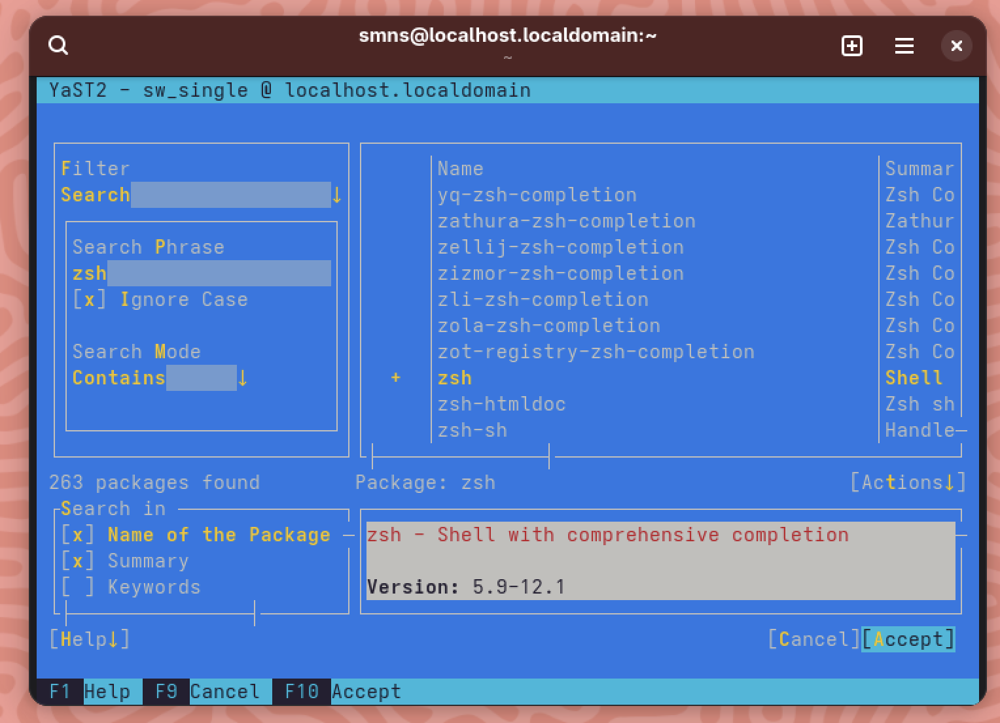
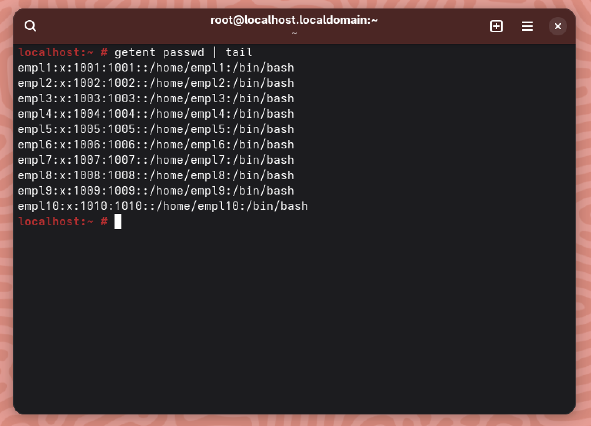
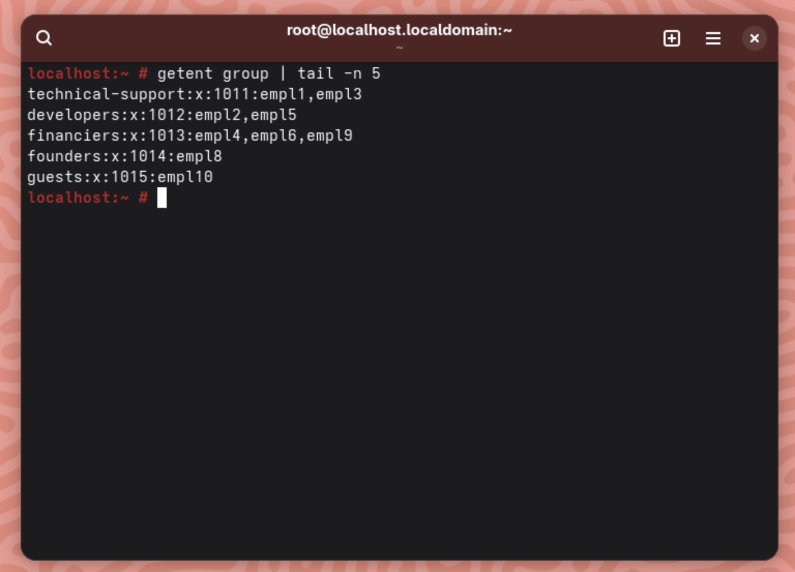
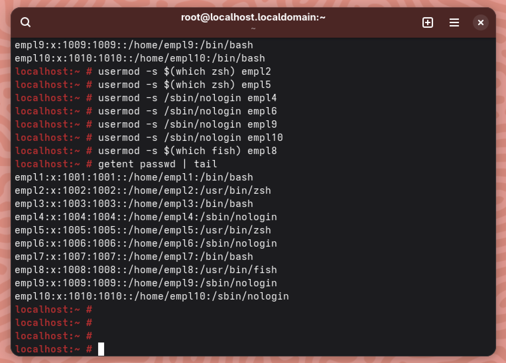

# Work-case №6

**Виконували:**

- Машовець Аліна
- Шурубор Назар

## Завдання

Розгляньте дані питання та дайте відповіді:

1. В робочому просторі операційної системи необхідно встановити декілька командних інтерпретаторів (окрім `bash` ще 2 на ваш вибір):

    We're going to install `zsh` and `fish`.

    - Якими командами це можна зробити;

        We're currently using openSUSE Tumbleweed, which has a YaST package manager.
        It's a user friendly TUI (Terminal User Interface), so there's no need to memorize commands.
        By running the following command we can get to the TUI:

        ```sh
        sudo yast
        ```

        Now we just search for `zsh` and `fish` and install them:

        

        Now we can run `zsh` to switch into that shell. We will first need to quickly set it up.
        Also we can run `fish` just to check if it work, but it's already operational out-of-the-box.

    - Опишіть коротко можливості кожного з них.

2. Необхідно створити 10 нових користувачів у вашій системі та розподілити їх по групам:
    - Technical support (технічна підтримка, системні адміністратори);
    - Developers (розробники, технічні спеціалісти свого профілю);
    - Financiers (бухгалтерія, економісти тощо);
    - Founders (керівництво);
    - Guests (гості).

    Let's create the users:

    ```sh
    sudo useradd -m empl1
    sudo passwd empl1
    ```

    And repeat that 10 times. Here's our resulting `passwd` file:

    

    Now let's create the groups:

    ```sh
    sudo groupadd technical-support
    sudo groupadd developers
    sudo groupadd financiers
    sudo groupadd founders
    sudo groupadd guests
    ```

    Here's the distribution of users we went with:

    ```sh
    sudo usermod -aG technical-support empl1
    sudo usermod -aG technical-support empl3
    sudo usermod -aG developers empl2
    sudo usermod -aG developers empl5
    sudo usermod -aG financiers empl4
    sudo usermod -aG financiers empl6
    sudo usermod -aG financiers empl9
    sudo usermod -aG founders empl8
    sudo usermod -aG guests empl10
    ```

    And here's how the `/etc/group` file looks like

    

3. Для кожного з користувачів визначити його командний інтерпретатор за замовчуванням:
    - Technical support – `bash`;
    - Developers – командний інтерпретатор 1 (завдання 1);
    - Financiers – заборонити доступ до командних інтерпретаторів;
    - Founders – командний інтерпретатор 2 (завдання 1);
    - Guests – заборонити доступ до командних інтерпретаторів.

    Let's set users' default shells with the `usermod` command and the `-s` argument.
    For users that need no access to the shell we will set the `/sbin/nologin` shell.
    Users `empl1` and `empl3` remain untouched as their shells are already `bash`.

    ```sh
    sudo usermod -s $(which zsh) empl2
    sudo usermod -s $(which zsh) empl5
    sudo usermod -s /sbin/nologin empl4
    sudo usermod -s /sbin/nologin empl6
    sudo usermod -s /sbin/nologin empl9
    sudo usermod -s /sbin/nologin empl10
    sudo usermod -s $(which fish) empl8
    ```

    Here's the content of the `passwd` file, which displays the shells applied:

    

4. Продемонструвати приклади роботи кожної групи користувачів у своєму командному інтерпретаторі – наприклад збір відомостей про систему, визначення базової конфігурації, системної дати, поточних каталогів тощо.
