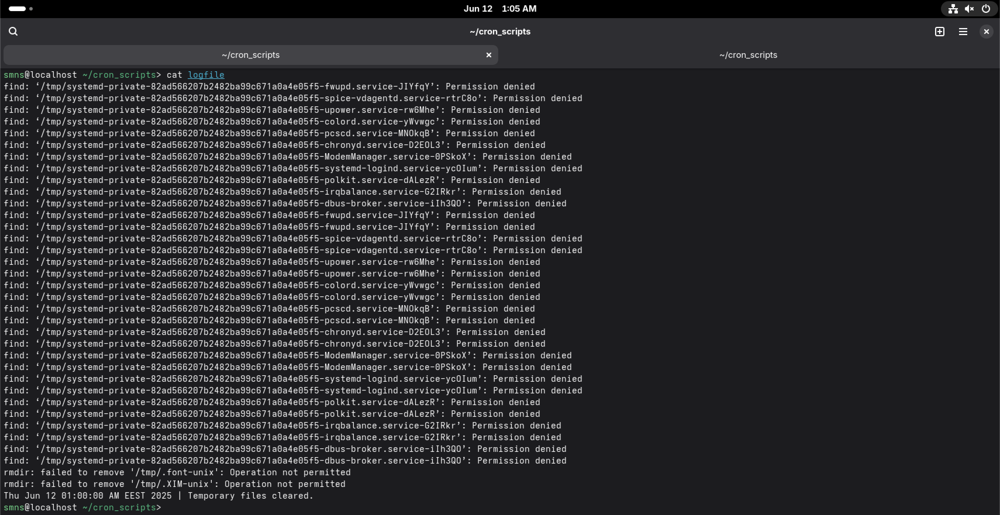

# Work-case №7

**Виконували:**

- Машовець Аліна
- Шурубор Назар

## Завдання

Розгляньте дані питання та дайте відповіді:

1. В ході роботи досить часто виникає завдання планування задач:
    - Охарактеризуйте основні функції які може виконувати планувальник завдань в будь-якій ОС. Порівняйте можливості планування завдань в різних ОС на прикладі Windows та Linux.
    - Опишіть основні принципи роботи з планувальником Cron в ОС Linux. Як його налаштовувати? Чи є йому альтернативи (дайте їх характеристику).

2. Для вашої віртуальної машини зі встановленою ОС Linux здійсніть планування обраних вами задач (запуск додатків, вмикання/вимикання машини, очистка каталогів, видалення файлів, резервне копіювання, архівування тощо на ваш вибір) через планувальник Cron:

    Let's make a simple bash script that deletes old temporary files:

    ```sh
    #!/bin/bash
    find /tmp -type f -mtime +1 -delete         # Delete files older than 1 day
    find /tmp -type d -empty -exec rmdir {} \;  # Delete empty directories
    echo "$(date) | Temporary files cleared."
    ```

    - Виконання спланованої задачі в чітко визначений Вами час (наприклад о 8 ранку, 18:30 і т.д.).

        Let's say we want to clear temp files at 1 AM (because that's the closest time to when we are writing this).

        To edit Cron jobs we run `crontab -e` and add the following job:

        ```cron
        0 1 * * * /home/smns/cron_scripts/clear_temp.sh >> /home/smns/cron_scripts/logfile 2>&1
        ```

        Here we specify that the job runs at 0 minutes at 1 AM at any day or month.
        Also we output the stdout and stderr to a logfile, so we can see that the
        job executed.

        After waiting till 1 AM we can check the `logfile` and see the following:

        

        Other than some files owned by `root` everything works and we can see the execution time being exactly 1 AM.

    - Виконання однієї й тієї ж задачі двічі в день (час також визначаєте самостійно).

        We can provide a comma-seperated list of values to the fields.
        So to make our command execute twice a day we could just put two values in
        the hour field. For example this will run the command at 9 AM and 9 PM:

        ```cron
        0 9,21 * * * /home/smns/cron_scripts/clear_temp.sh >> /home/smns/cron_scripts/logfile 2>&1
        ```

    - Виконання однієї й тієї ж задачі тільки в будні (або тільки у вихідні дні) у чітко визначений проміжок часу (наприклад з 8 до 18 години).

        Similar thing to the previous task, but with the day of the week field:

        ```cron
        0 9 * * 1-5 /home/smns/cron_scripts/clear_temp.sh >> /home/smns/cron_scripts/logfile 2>&1
        ```

    - Виконання задач тільки раз у рік, раз у місяць, раз у день, щогодини, при вмиканні (після перезавантаження).

        Once per year (on January 1st at 9 AM):

        ```cron
        0 9 1 1 * /home/smns/cron_scripts/clear_temp.sh >> /home/smns/cron_scripts/logfile 2>&1
        ```

        Once per month (every 2nd at 9 AM):

        ```cron
        0 9 2 * * /home/smns/cron_scripts/clear_temp.sh >> /home/smns/cron_scripts/logfile 2>&1
        ```

        Once per hour (every hour):

        ```cron
        0 * * * * /home/smns/cron_scripts/clear_temp.sh >> /home/smns/cron_scripts/logfile 2>&1
        ```

        After reboot:

        ```cron
        @reboot /home/smns/cron_scripts/clear_temp.sh >> /home/smns/cron_scripts/logfile 2>&1
        ```

3. Встановіть альтернативний Cron’у планувальник задач (на Ваш вибір). Виконані у завданні 2 дії продемонструйте через нього.
