# Work-case №8

**Виконували:**

- Машовець Аліна
- Шурубор Назар

## Завдання

Розгляньте дані питання та дайте відповіді:

1. При роботі з серверними системами або на комп’ютерах, що досить обмежені у ресурсах, досить часто графічну оболонку вимикають або взагалі не встановлюють. Іноді виникають задачі, які здається, що без графічної оболонки виконати не можливо, проте для ОС Linux це не так. Спробуйте через термінал виконати наступні дії та поясніть за допомогою яких команд (пакетів) їх можна виконати:

    - Перегляд файлів та папок через файловий менеджер у терміналі.

        For that there exist TUIs like `nnn`, which we will install:

        ```sh
        sudo zypper install nnn
        ```

        Now we can just simply run `nnn` and see it work:

        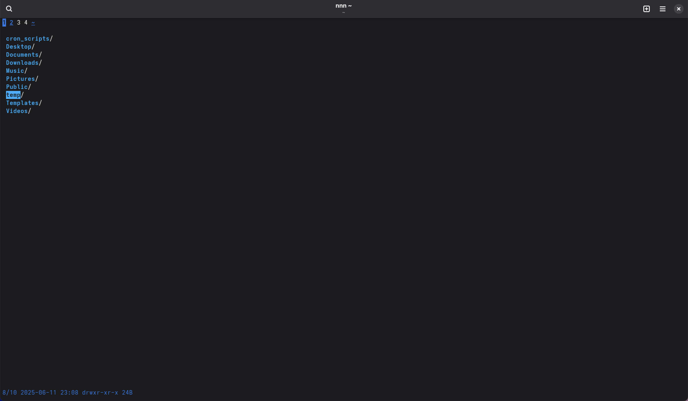

    - Переглядати веб-сторінки через браузер, що працює у терміналі.

        To view web pages in the terminal we could use something like `w3m`:

        ```sh
        sudo zypper install w3m
        ```

        And open a page:

        ```sh
        w3m https://google.com
        ```

        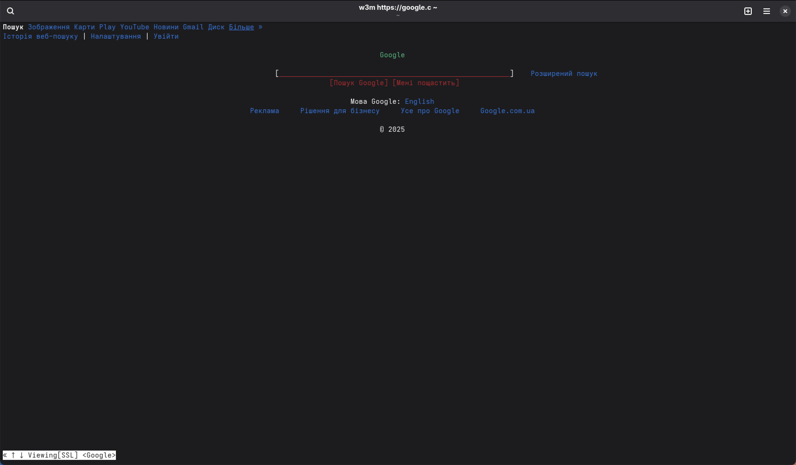

    - Перегляд електронної пошти в терміналі.

        Let's try `neomutt` for this!
        After a bit of setting it up, because the default configuration didn't work as excepted
        we can now browse local mail:

        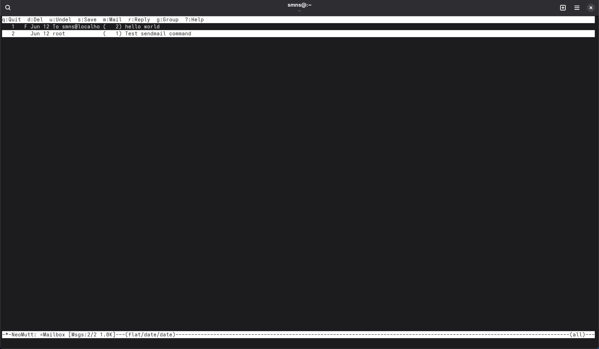

        And here's viewing one of the received mails:

        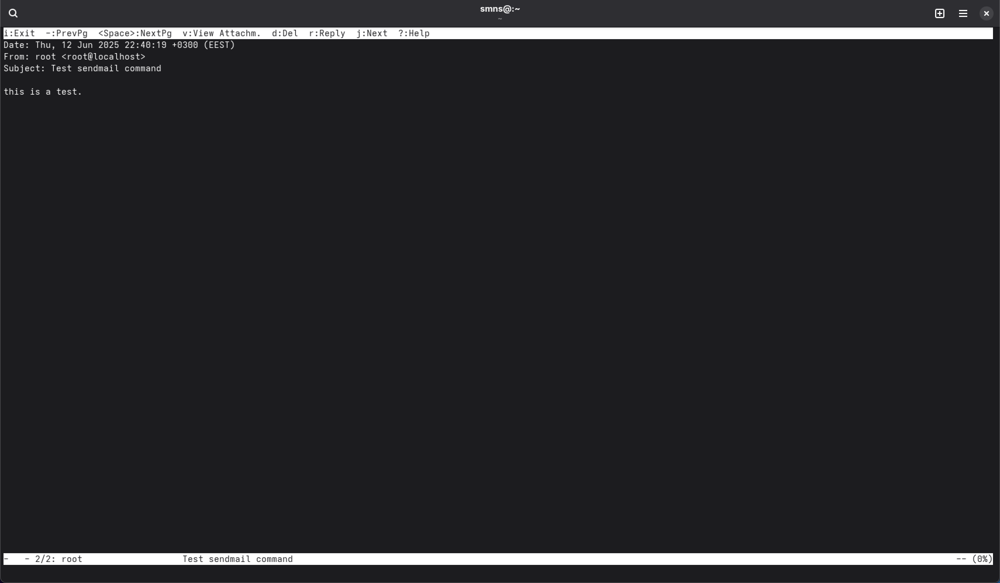

        Also, when cron jobs get output they send it as a local mail to the executor, so we can
        see it here (using an example cron job from [work-case 7](./7.md)):

        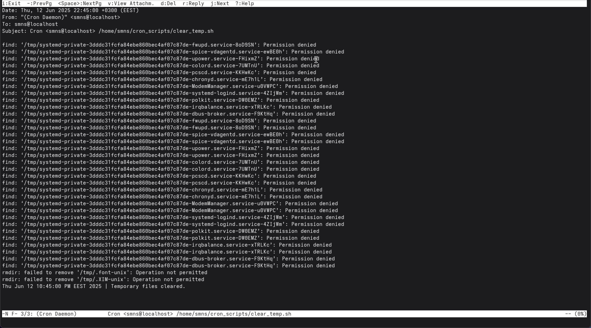

    - Слухати музику через термінал.

        To listen to music we could use `cmus`.
        Inside we need to add the song to the library:

        ```cmus
        :add Downloads/katarsis-tavo-akys.mp3
        ```

        And now we can play it!

        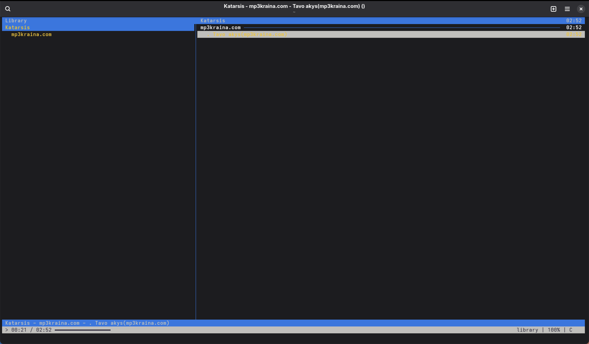

    - Скачувати торенти через термінал.

        To download torrents we can use the `transmission` client, especially it's CLI variant.

        Let's try downloading an Arch Linux ISO using a Magnet link:

        ```sh
        transmission-cli "Downloads/archlinux-2025.06.01-x86_64.iso.torrent"
        ```

        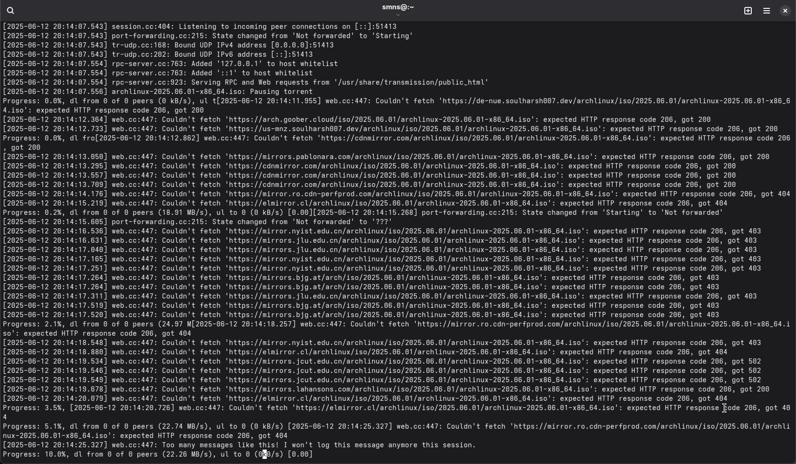

        And after a bit of waiting we notice that the client is now seeding the torrent, so we can
        quit out and we will see the actual Arch Linux ISO in the `Downloads` folder.

    - Планувати дії в календарі та нагадувати про них через термінал.

        Let's try using `calcurse` for this!

        Here's what we get when opening it:

        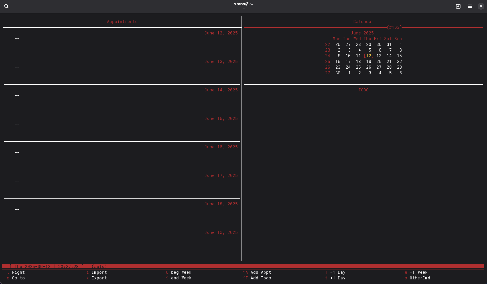

        We have an iCal calendar with out college schedule, so let's try importing that as a showcase.
        First we need to download it into a file. I've downloaded it into `~/Downloads/college-schedule.ical`.
        In calcurse we can tap `i` to import and enter the path to the file. After importing all those
        events show up in the calendar and here's how it looks like:

        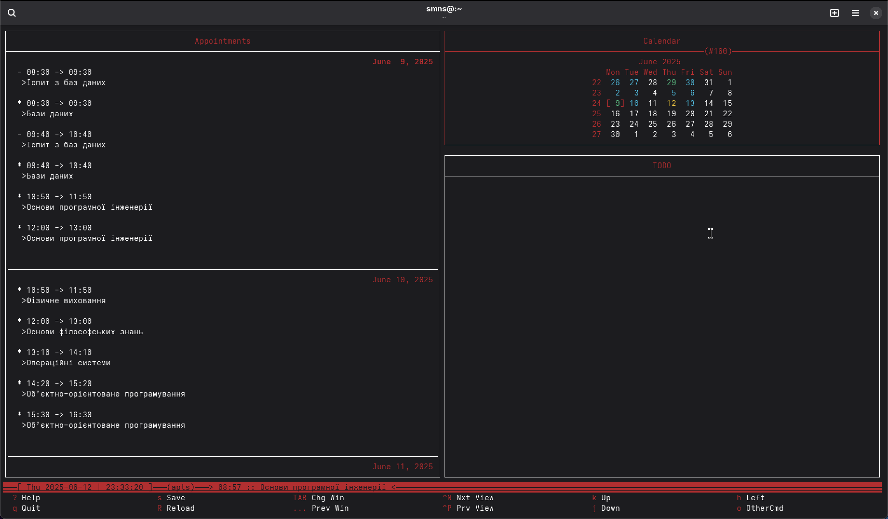

    - Переглядати зображення в терміналі

        To view images there exist several tools, most known of them are `FIM` and `viu`.
        We didn't manage to get `FIM` working, but `viu` did, so here it is in GNOME Console:

        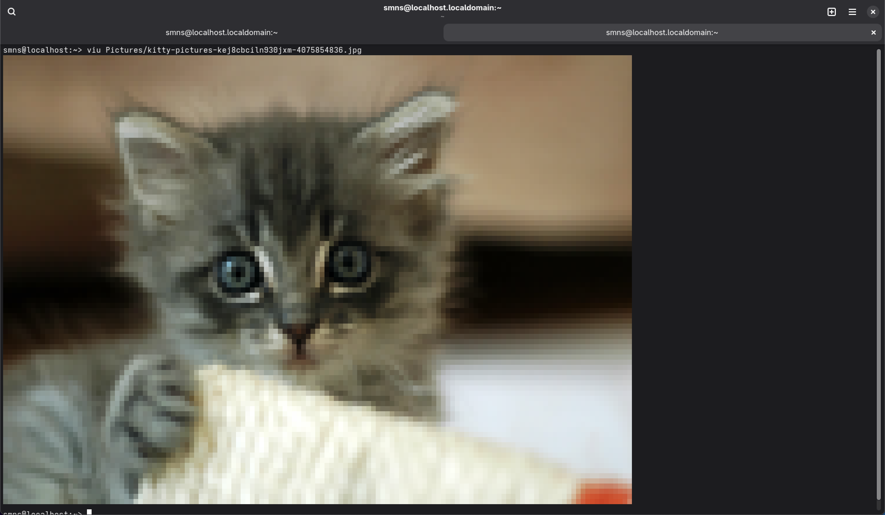

        Looks underwhelming and pixelated. That's because all of this is basically rendered
        with regular symbols. Viu also supports rendering the image at a high resolution,
        however we need a more featureful terminal for that, like KiTTy. In short, it can
        use OpenGL and GLFW shaders to render lots of things. So here's the image in high
        resolution inside KiTTy:

        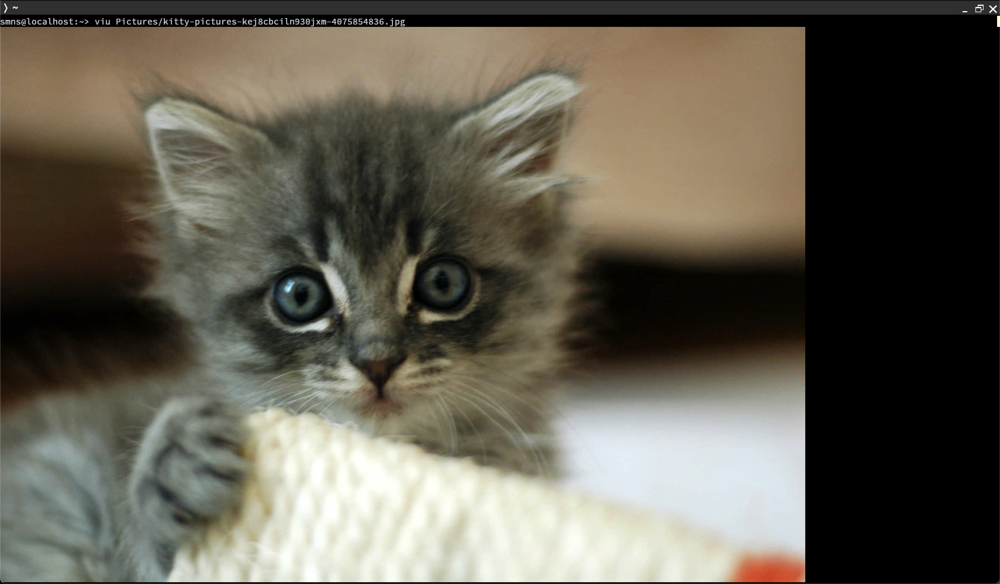

2. Існують також дії які є класичними для більшості адміністраторів та мають досить різноманітний функціонал. Опишіть різні програми (команди, пакети) та встановіть по одній на кожну дію у терміналі:
    - Вводити, редагувати, видаляти текст (редактори файлів).
    - Здійснювати моніторинг процесів та ресурсів системи (аналог диспетчера задач або системного монітора в графічній оболонці).

3. Задачі, щоб підняти настрій посеред робочого процесу ☺ – так звані «пасхалки» (нажаль підтримуються не всіма дистрибутивами):
    - Якщо Ви мрієте про подорож, то термінал може Вам показати зображення парового локомотиву з вагоном (гарний натяк на дорогу).
    - Якщо Ви фанат зоряних війн, то термінал може їх Вам показати.
    - Якщо ви любите тварин, то термінал Вам може організувати діалог з коровою.
    - Можливо Ви знаєте якісь цікаві інтерактиви, які не знаю я, то поділіться ними зі мною :)))
